# 방법론 상세 — 프로세스로 보는 4가지 분석

이 문서는 결과가 아니라 **어떻게 분석했는가(프로세스)**를 단계별로 설명한다. 네 분석은 각기 다른
방법 역량을 시연한다: ① 공간 추론(지도 그리기를 넘는 통계), ② robustness(가짜 신호 걸러내기),
③ 교란 통제(외부 데이터 + 계절 제거), ④ 공간×시간 결합(트렌드의 지역 수용). 수식은 유지하되
"쉬운 말"을 곁들인다.

데이터: NEIS 오픈API 전국 고교 중식, 2021–2026, 2,355개교 분석·약 220만 끼. 공통 전처리는
`menu_attributes.py`가 메뉴 텍스트를 43차원 해석 속성으로 태깅하고, `embeddings.py`가 FastText로
128차원 의미 임베딩을 학습한다. 모든 파이프라인은 `uv`(.venv)로 실행하고, 무거운 단계는
`systemd-run --user --scope -p MemoryMax=64G`로 64GiB 메모리 캡 아래 돌린다.

---

## 1. 공간 자기상관 — 급식 식문화의 공간 구조 (Moran's I · LISA)

`spatial_autocorr.py`(시도 17), `spatial_sigungu.py`(시군구 237).

### 질문
기존 KMeans 군집은 *공간*을 무시한다(특성공간에서만 묶음). 그래서 "식문화가 공간적으로
구조화됐는가 — 이웃 지역끼리 닮는가"를 답하지 못한다. 이걸 공간통계로 검정한다.

### 단계
1. **메뉴 → 숫자**: 끼니의 메뉴 텍스트를 토큰화해 43차원 속성 비율 + 128차원 FastText 임베딩으로.
2. **지역 집계**: 학교 벡터를 시군구로 평균. 학교 주소(도로명)의 2번째 토큰으로 시군구를 매핑하되,
   2013년 geojson과 현 행정구역 차이를 보정 — 부천·청주는 구 분할 불일치라 시로 합치고(dissolve),
   미추홀구←남구 개명, 군위군 경북→대구 이관. (매칭 97.5% → 보정 후 거의 전수)
3. **공간가중행렬 W**: 경계를 맞댄 시군구를 이웃(=1)으로 두는 Queen 인접. 행 표준화.
   제주는 섬이라 무연결 → 최근접(전남)과 수동 연결. *이 섬 처리 자체가 GIS 의사결정 포인트.*
4. **Global Moran's I** — 전국이 '끼리끼리'인가 한 숫자로:

   I = (n / S₀) · ( Σᵢ Σⱼ wᵢⱼ zᵢ zⱼ ) / ( Σᵢ zᵢ² ),  z = 값 − 평균,  S₀ = Σᵢ Σⱼ wᵢⱼ

   *쉬운 말*: 각 지역과 그 이웃이 같은 방향(둘 다 높거나 둘 다 낮음)이면 +점, 엇갈리면 −점. 전국
   평균내 한 숫자로. **+1** 완전 끼리끼리 · **0** 무작위 · **−1** 체스판처럼 교대.
5. **Local Moran's I (LISA)** — 어디가 뭉치고 어디가 튀나:

   Iᵢ = zᵢ · Σⱼ wᵢⱼ zⱼ

   지역별로 HH(다같이 높음=핫스팟)·LL(다같이 낮음)·HL·LH(주변과 다른 '튀는 곳') 4분류.
6. **추론**: 999회 **순열검정**(지도 위 값을 무작위로 섞어 비교)으로 p값. seed 고정으로 재현.

### 핵심 결정 — '표본의 함정'
처음엔 빠른 검증을 위해 시도당 30개교만 샘플링(502교)했는데 '해안성'이 Moran's I=0.42로 1위였다.
그러나 전체(2,355교)로 받자 0.25로 약화되고 해산물↔육류는 0.04(무의미)로 붕괴 — **작은 표본이
가짜 1위를 만든 사례.** 이후 모든 결론은 전수에 가까운 데이터로 재검증했다.

### 결과
시군구 237개에서 9개 축 전부 p=0.001로 유의(고해상이라 자기상관이 보편적 — Tobler 법칙). 밥
점유율 I=0.54 최강. 매운맛은 영남(경북·대구) 핫스팟·수도권 콜드, 양식화는 수도권 핫스팟·호남 콜드
→ "수도권 ↔ 지방" 축. 내륙인 안동·영양이 해산물 핫스팟(간고등어 향토색).

**과정 그림.** Moran 산점도(시군구 237, 밥 점유율 I=0.54 — 점이 우상향이면 "값 높은 시군구는 이웃도 높다"):

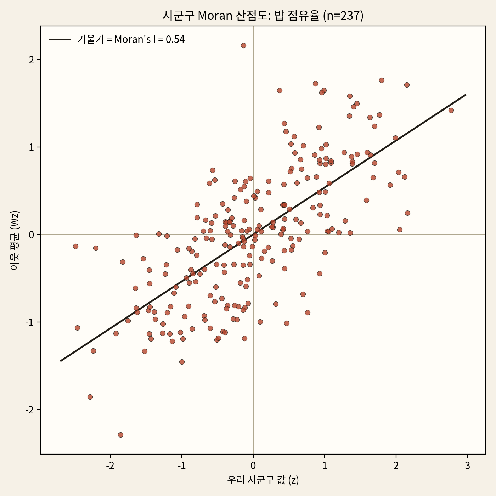

LISA 지도 (빨강 HH=핫스팟, 파랑 LL=콜드스팟, 분홍/연파랑=공간 이상치):

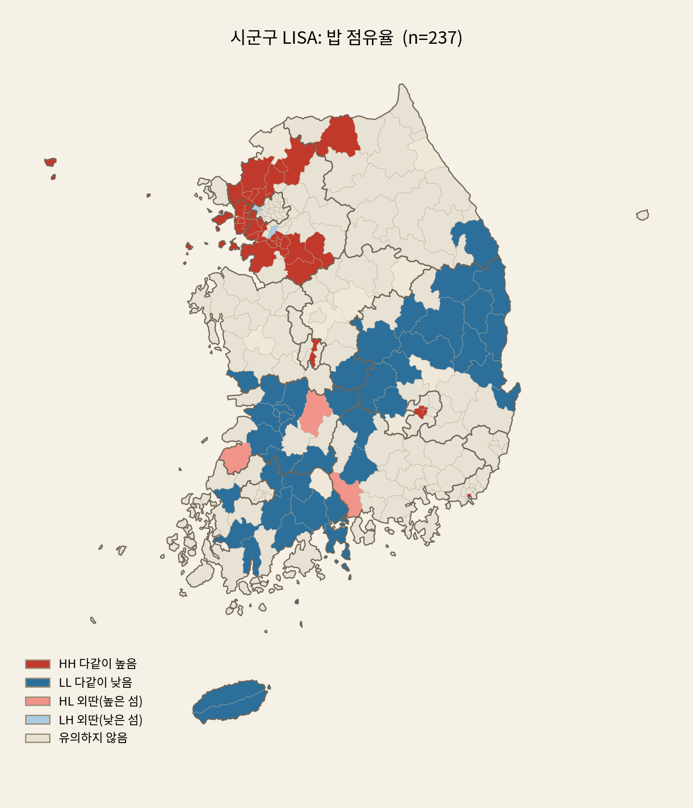 
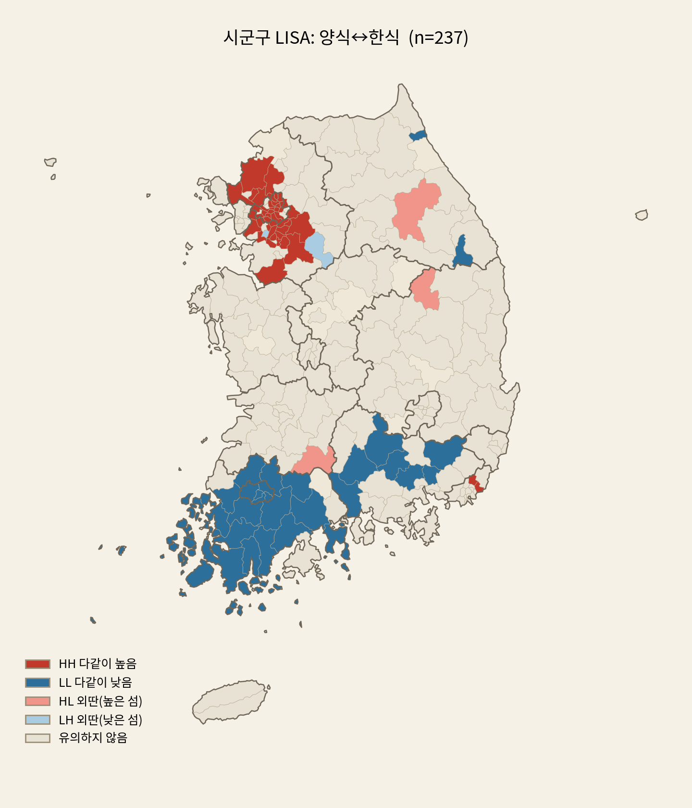 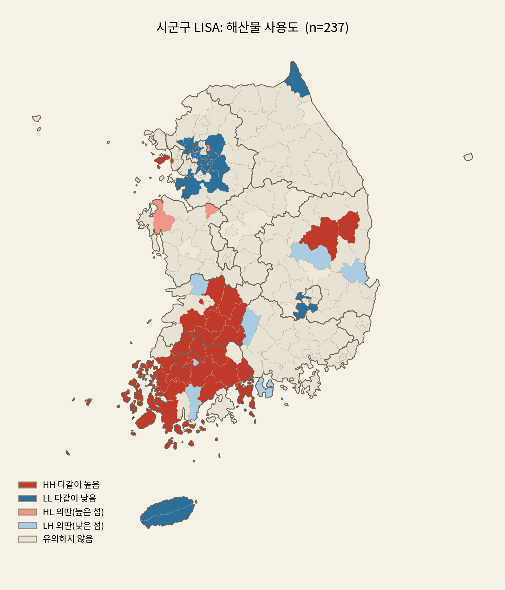

### 한계
공간 단위가 행정구역이라 임의적(MAUP). n=17 시도는 검정력이 약해 시군구로 보강. geojson 행정구역이
2013 기준이라 보정 필요.

---

## 2. 동질화 가설 검증 — 반복적 robust화

`hypothesis_homogenization*.py`, `hypothesis_homog_robust.py`, `hypothesis_who_converges.py`.

### 가설
- **H0**: 시도 간 식단 거리는 시간에 따라 변하지 않는다.
- **H1**: 줄어든다(동질화) 또는 늘어난다(다양화).

이 분석의 핵심은 *결과*가 아니라 **하나의 약한 신호를 어떻게 끝까지 검증·정정했는가**다.

### 단계 (정직화의 연쇄)
1. **연 5점**: 시도 속성 프로파일(CLR) 간 평균 쌍거리를 연도별로. balanced panel(5년 모두 연
   30끼+ 학교)로 표본 구성 변화를 통제. → 약함(p≈0.43). 점이 5개뿐이라 검정력 없음.
2. **시간 확장 시도**: NEIS가 더 과거를 주는지 확인 → **2021년부터만 제공**(4개교로 확인). 뒤로
   확장 불가 → 같은 창에서 **월 해상도(60점)**로 시간 점을 늘림.
3. **두 검정의 충돌**: 탈계절 분산 추세가 Mann-Kendall z=−2.76(유의)인데 학교 부트스트랩 p≈0.56
   (비유의). MK는 월 자기상관에 과대평가, 부트스트랩이 더 보수적·타당 → 순 동질화는 robust하지 않음.
4. **데이터 품질 catch**: 전북은 NEIS 중식이 2024년부터만(2021–23 학교 2개) — 커버리지 변화가
   가짜 동질화를 만들 수 있어 제외. (전수 커버리지 점검으로 전북만 유일한 구멍임을 확인)
5. **속성 분해**: 순 분산이 평탄한 건 상반된 움직임의 상쇄일 수 있다 → 속성별 지역 간 분산 변화를 봄.
   겉보기엔 발효·찌개 수렴 + 돼지고기·중식 발산(이중 과정)처럼 보였다.
6. **robust화** (`hypothesis_homog_robust.py`): 끝점 비율은 노이즈다 → 속성별 분산을 **월 60점
   추세**로, 학교 부트스트랩(300) + Mann-Kendall로 CI·p. 다중비교는 Bonferroni(0.05/43)로 점검.
   → **유의 5/43뿐.** 발효 −72%(p<.001)·찌개 −64%(p<.001)·김치·나물만 견고하게 수렴.
   **돼지고기·중식(마라)의 '발산'은 CI가 0을 크게 가로질러 노이즈로 탈락** — robust화가 false
   signal을 걸러냄.
7. **누가 누구로** (`hypothesis_who_converges.py`): 수렴한 4축을 z합 '전통 손맛 지수'로. 시도 궤적과
   β-수렴(2021 평균 편차 vs 변화) 검정. → 16개 시도 **전부 동반 하락**, β-수렴·spread 축소 모두
   비유의 → '특정 지역으로의 수렴'이 아님.
8. **재정의**: robust 동질화의 정체는 *공간 수렴*이 아니라 **전통식(발효·찌개·김치·나물)의 전국적
   후퇴**(시간 추세) — 급식의 세대적 현대화. (B-트렌드의 쌀밥·우유↓, 마라·잡곡↑과 한 그림)

**과정 그림** (정직화의 연쇄).

월 60점 탈계절 분산 추세 — 순 동질화는 평탄·비유의(step 3):

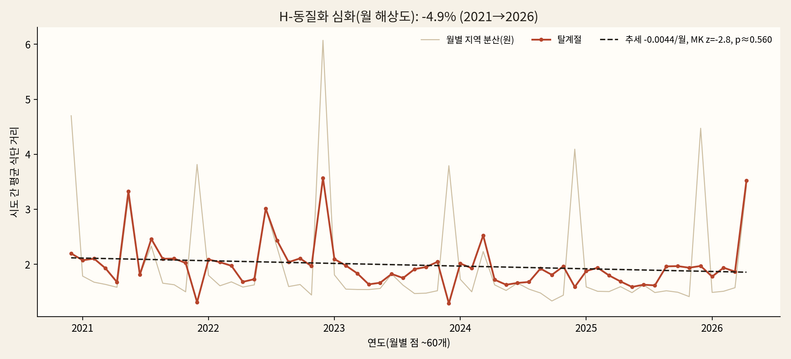

겉보기 분해(끝점비, 이중 과정처럼) → robust forest(★만 유의, 발산 후보는 노이즈로 탈락) (step 5→6):

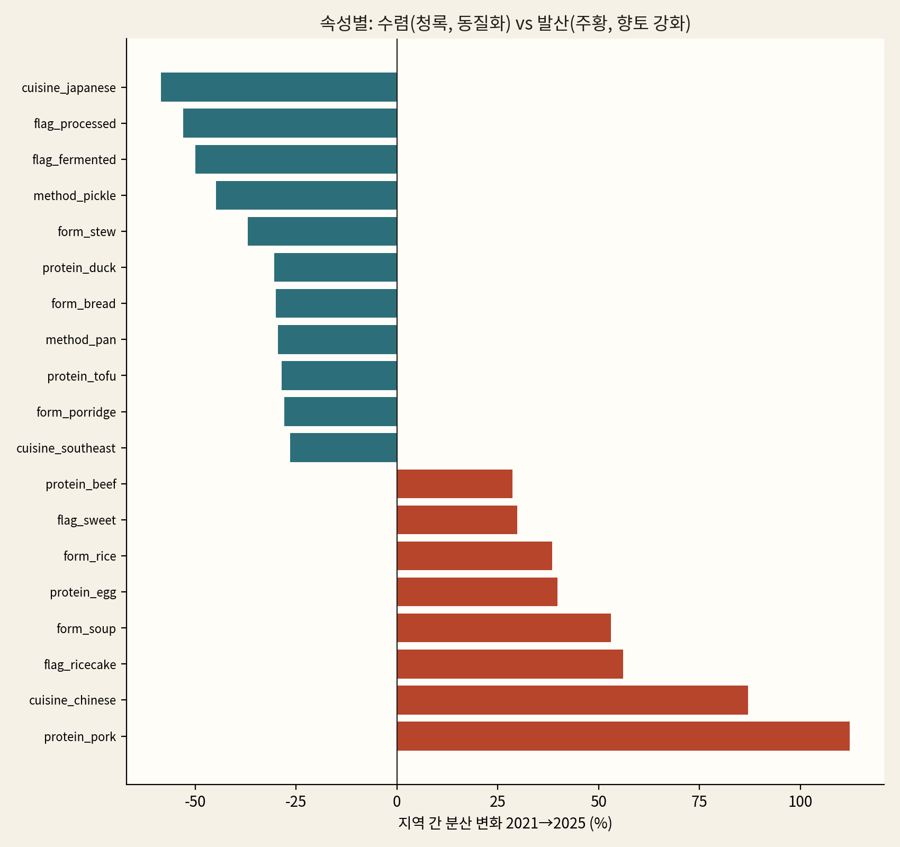 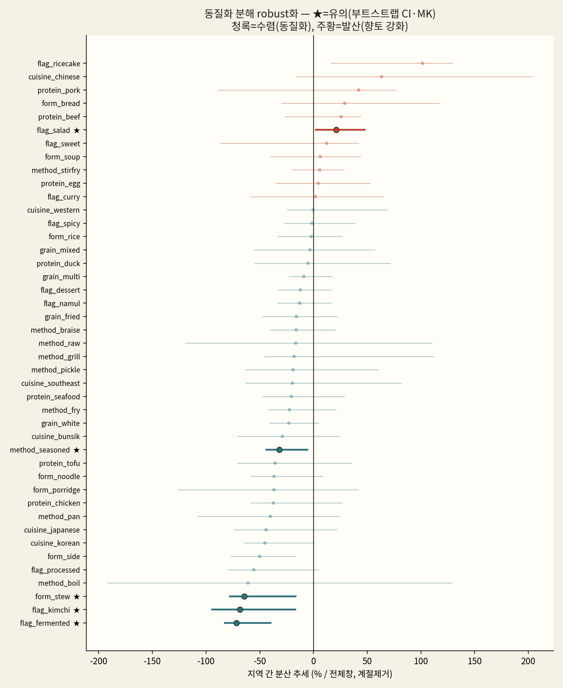

지역 MDS 궤적(전북 제외) · '누가 누구로' — 16개 시도 동반 하락 + β-수렴 비유의(step 7):

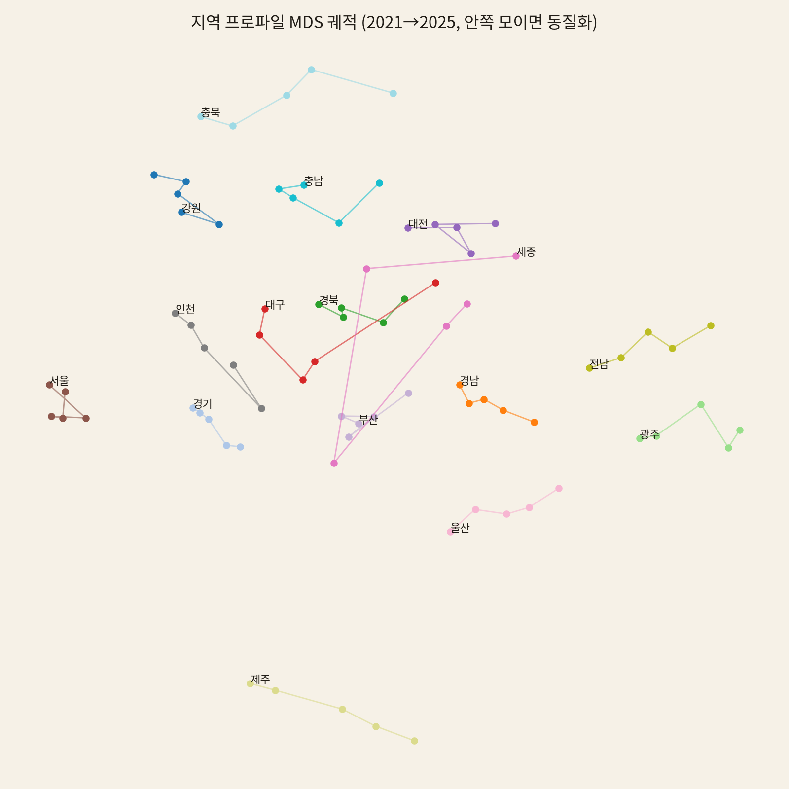  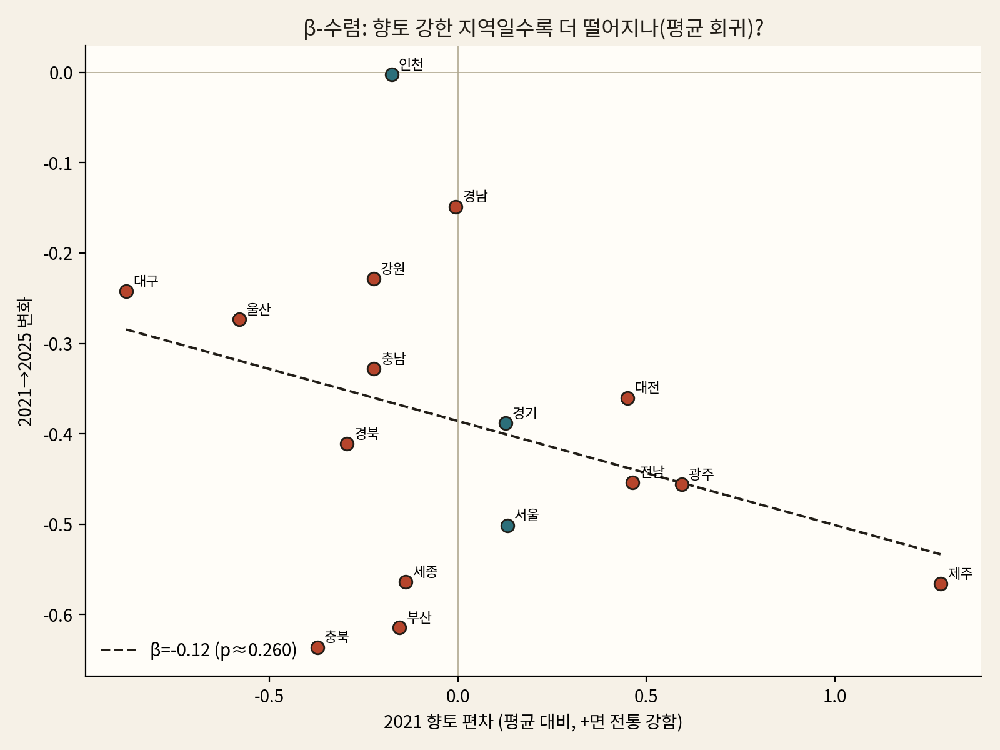

### 교훈
보이는 신호(이중 과정·중식 발산)를 robust 검정으로 두 번 정정. **"보이는 게 다가 아니다"**를 부트스트랩·
MK·Bonferroni·데이터 품질 점검으로 데이터로 보였다.

### 한계
5년은 문화 드리프트엔 짧으나 더 긴 baseline은 NEIS가 안 줌. 분해 %는 분산비라 노이즈가 커서 robust
검정이 필수였다.

---

## 3. 날씨 통제 검정 — 교란을 제거하면 (H-날씨)

`hypothesis_weather.py`. 기온은 Open-Meteo 아카이브(무료·키 불필요) 7개 도시 일평균.

### 가설
- **H0**: 계절을 제거하면 그날 기온과 메뉴 구성은 무관(식단은 미리 짠 캘린더에 고정).
- **H1**: 추운 날 국물요리↑ / 더운 날 냉면↑.

귀무가설(무반응)이 매우 그럴듯하다(식단표는 몇 주 전 확정) → 기각 여부 자체가 흥미로운 진짜 검정.

### 단계
1. **외부 데이터 결합**: 전국 7개 도시 일평균기온을 받아 평균 → 전국 일별 기온.
2. **메뉴 신호**: 일별 국물요리(된장국·찌개·삼계탕…) 비중과 냉면류 비중.
3. **계절 제거(deseasonalize)**: 각 값에서 day-of-year 기후값(±7일 순환 평활)을 빼 **이상치**를 만든다.
   기온과 계절은 강하게 얽혀 있어, 같은 달 안에서 *유난히 추운 날*에 반응하는지를 봐야 하기 때문.
4. **검정**: corr(기온 이상치, 메뉴 이상치). 음(국물)·양(냉면)이면 반응. 평일·끼수 충분한 학교일만.
   2주 블록 부트스트랩으로 CI(시간 자기상관 반영).

### 핵심 — 통제가 가짜 상관을 드러냄
계절 제거 **전** raw 상관: 기온 × 냉면 r = **+0.585**(강함!). 계절 제거 **후**: r ≈ **0.02**(무의미).
→ 겉보기 0.585는 전부 계절 교란. 캘린더를 빼면 그날 날씨 효과는 0. **급식은 날씨가 아니라 캘린더에
고정**돼 있다(귀무 채택). 상관≠인과, 교란 통제의 교과서 사례.

**과정 그림.** 계절 제거 후 기온 이상치 vs 메뉴 이상치 — 기울기 ≈ 0(무반응). (raw 기온×냉면은 +0.585였으나 전부 계절 교란):

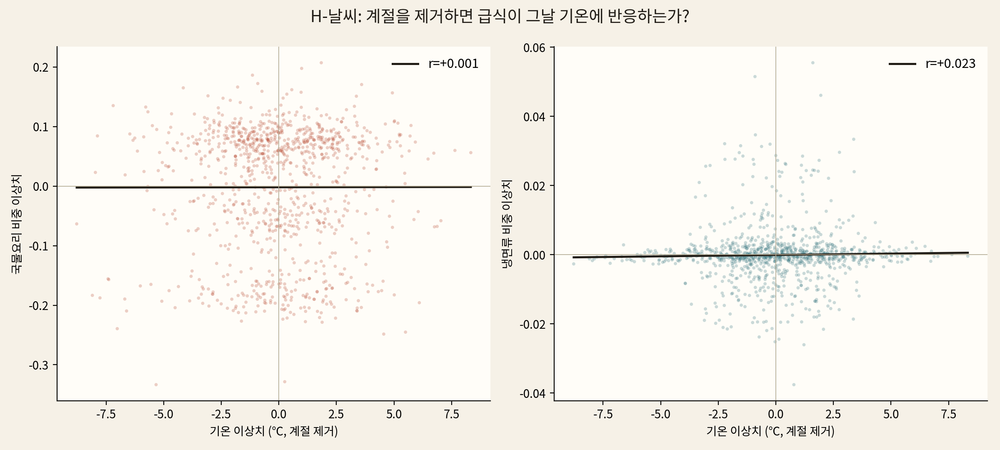

### 한계
전국 평균 기온·메뉴라 지역별 반응은 못 봄. 방학(끼 적은 날) 제외로 극단 기온일이 일부 빠짐.

---

## 4. 트렌드 지역 민감도 — 공간 × 시간 결합

`trend_sensitivity.py`. 시간 분석(어떤 유행이 떴나)과 공간 분석(어디서)을 잇는다.

### 질문
전국적으로 떠오른 음식 트렌드(마라·두바이초콜릿…)를 어느 지역이 빨리 받아들이고(민감) 어디가
둔감한가? "도시·수도권이 트렌드 리더"라는 통념이 급식에 맞는가?

### 단계
1. **유행 바스켓 정의**: 전국적으로 robust하게 상승한 메뉴 — 마라·마라탕·두바이·탕후루·약과·
   그릭·바질·비건.
2. **시도별 수용도**: 각 유행의 (시도, 연도) 등장률(천 끼당). 전북은 NEIS 중식이 2024부터라 제외.
3. **트렌드 수용 지수**: 유행별로 ① 2025 수준과 ② 2021→25 증가를 시도 간 z-표준화해 평균
   (항목 등가중 → 마라 같은 대형 유행이 지수를 지배하지 않게).
4. **검정·해석**: 랭킹·코로플레스, 수도권 vs 비수도권·서울 거리 상관, 유행별 지역 편차(CV로
   어떤 유행이 균일하고 어떤 게 지역적인지).

### 결과
광주(+0.46)·경북(+0.43)·대구(+0.34)가 민감, 경남(−0.80)·서울(−0.36)이 둔감. 수도권(−0.14) <
비수도권(+0.03), 서울 거리와 무관(r=+0.07, p=0.81) → **"도시=트렌드 리더" 통념 기각**(수도권
둔감은 견고). 대형 유행(마라 CV 0.19)은 전국 균일, 틈새 유행(비건·바질·두바이)만 지역적.
단 대구 우위는 마라/마라탕 단일 유행 의존(이중계수 제거·부트스트랩 1위 53%)이며, 견고한 건 광역
방향(수도권 둔감)이다. §1 공간분석의 '매운맛=영남 핫스팟'과 결이 같다.

 

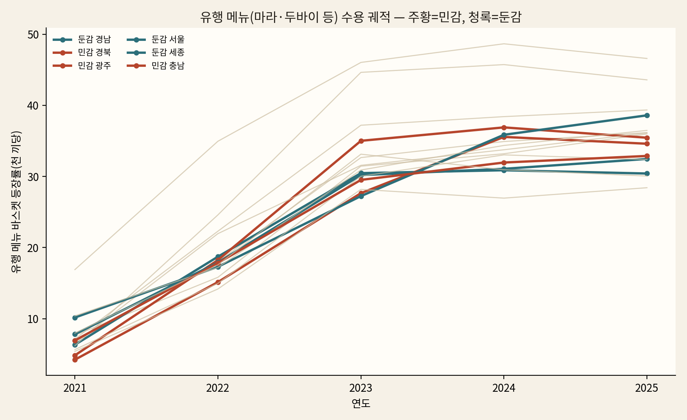

### 한계
바스켓이 마라에 다소 지배되지만 항목 등가중 지수·랭킹에서도 결론(대구↑·서울↓)은 견고. 시도(16)
단위라 시군구로 보강 여지. 경남이 영남인데 둔감한 점은 추가 분석 여지.

---

## 공통 인프라
- **환경**: `uv venv` + `uv pip install -r requirements.txt`, 실행 `.venv/bin/python`.
- **메모리 캡**: 무거운 벡터화·부트스트랩은 `systemd-run --user --scope -p MemoryMax=64G
  -p MemorySwapMax=0`로 전체 프로세스 트리 RSS를 64GiB로 제한(초과 시 종료).
- **재현성**: 순열·부트스트랩·KMeans 모두 seed 고정. 단 FastText는 `workers>1`이면 비결정적이라
  임베딩 재학습 시 미세 변동 가능(seed 고정으로 완화).
- 진행 로그: [`docs/PROGRESS.md`](docs/PROGRESS.md) (주제별 상세는 `docs/progress/`).
