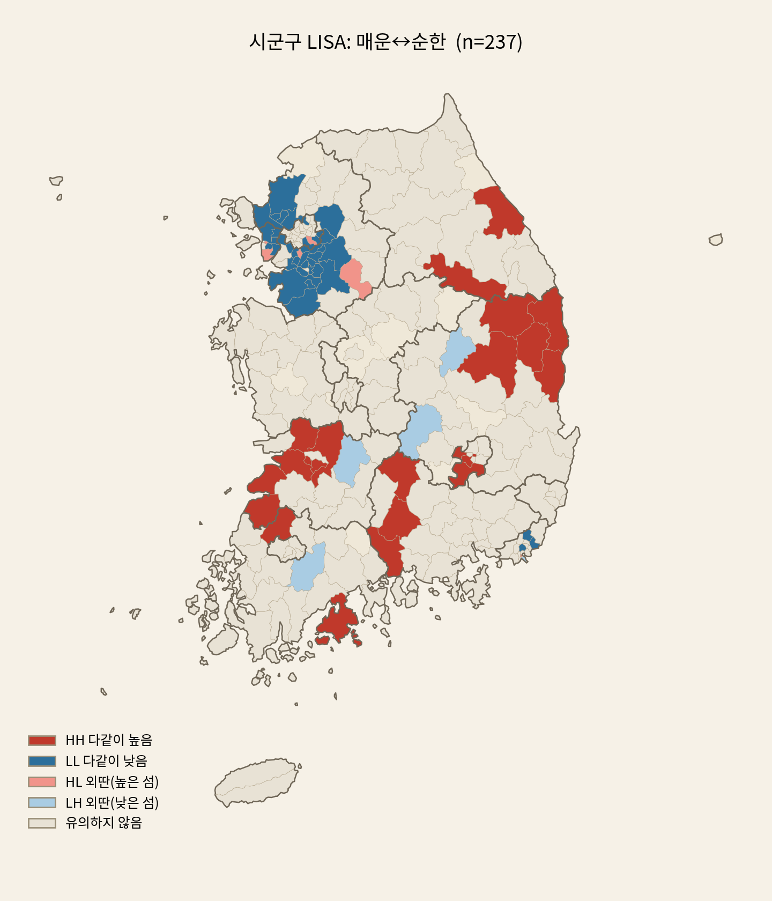
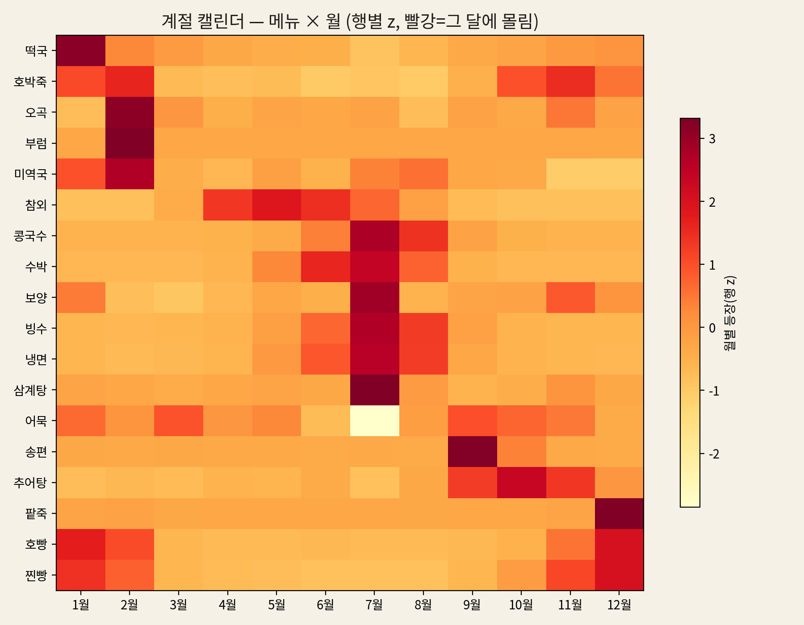
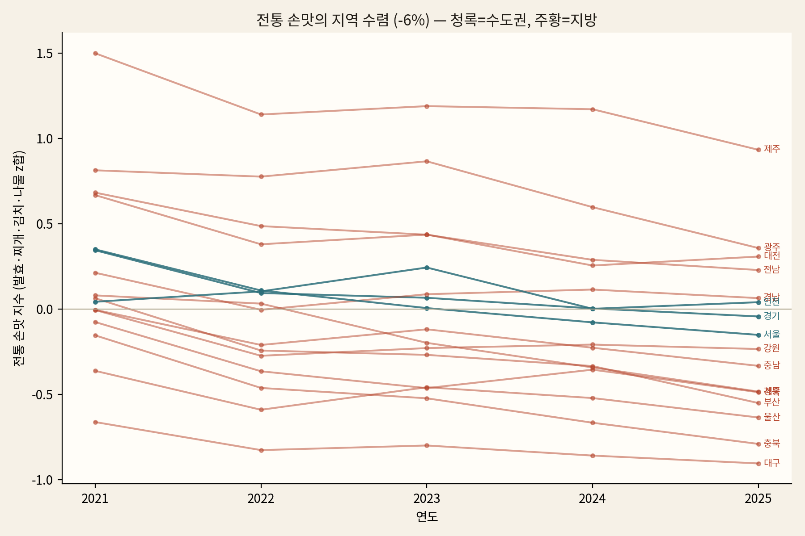

# NEIS 고등학교 중식 식단 군집 · 지도 시각화 파이프라인

전국 고등학교 **중식**(2021~현재)을 **107차원**(속성 43 + 임베딩 64) 벡터로 표현해
학교별 군집을 만들고, 시도별 지표를 한국 지도(코로플레스)로 시각화한다.

## 주요 발견 (Top 6, 강한 순)

전국 고교 중식 2,355개교·약 220만 끼(2021~2026) 분석. 메뉴 텍스트를 43차원 속성 +
128차원 FastText 임베딩으로 표현해 공간(Moran's I·LISA)·시간 분석과 가설 검정을 수행했다.

1. **급식 식문화는 강하게 공간 구조화돼 있다.** 시군구 237개 단위에서 9개 식문화 축이
   전부 공간 자기상관 유의(Moran's I, p=0.001). 밥 점유율 I=0.54로 최강. 매운맛은 영남
   (경북·대구) 핫스팟·수도권 콜드, 양식화는 수도권 핫스팟·호남 콜드 — "수도권 ↔ 지방" 축.
   (`spatial_sigungu.py`, `spatial_autocorr.py`)

   


2. **급식은 전통 절기 캘린더를 따른다.** 설 떡국(1월 약 4배 급증)·정월대보름 오곡/부럼·
   삼복 삼계탕(7월)·추석 송편(9월)·동지 팥죽(12월에만). 데이터 주도로 가장 계절 타는
   메뉴는 제철 과일(자두·수박 7월, 단감 11월, 딸기 2월). (`temporal_analysis.py`)

   


3. **음식 트렌드가 급식에 찍히지만 '메뉴화 가능한 것'만.** 마라 2021→25 ×6.9(Mann-Kendall=10
   완전 단조, CAGR 62%), 두바이초콜릿 ×21.5(2024 바이럴), 마라탕 ×6.1. 단 *절대량*은 마라가
   지배(유행 바스켓의 79%) — 두바이·탕후루는 배수만 크고 급식엔 거의 없다(간식형 유행은 미반영).
   동시에 흰쌀밥·우유 하락, 잡곡·귀리밥 상승(정백→통곡). (`temporal_analysis.py`, `trend_reflection.py`)

   


4. **전통 손맛의 지역차가 좁혀진다 — 동질화(homogenization).** 시도 간 분산이 발효
   −72%·찌개 −64%로 유의하게 축소(부트스트랩·Mann-Kendall, Bonferroni 통과) = **동질화**.
   단 그 정체는 특정 지역으로의 수렴이 아니라 16개 시도가 전통식(발효·찌개·김치·나물)을
   **동반 축소**하는 전국적 후퇴(β-수렴 ns)다 — 급식의 세대적 현대화.
   (`hypothesis_homog_robust.py`, `hypothesis_who_converges.py`)

   


5. **급식은 '그날의 날씨'에 반응하지 않는다.** 계절을 제거하면 일별 기온 이상치와
   국물요리·냉면 비중의 상관이 r≈0(비유의). 겉보기 강한 상관(기온×냉면 raw r=0.585)은
   전부 계절 교란이었다 — 식단은 미리 짠 캘린더에 고정. (`hypothesis_weather.py`, 기온=Open-Meteo)

   

6. **사회 음식 트렌드의 리더는 수도권이 아니라 지방(호남·영남)이다.** 유행 메뉴 바스켓
   수용 지수가 광주·경북·대구 상위, 서울(−0.36)·경남 최저. 수도권 −0.14 < 비수도권 +0.03,
   서울 거리와 무관(p=0.81) → "도시=트렌드 리더" 통념 기각(수도권 둔감은 견고). 대형 유행
   (마라)은 전국 균일, 틈새 유행(비건·바질)만 지역적. 단 대구 우위는 마라 단일 유행 의존.
   (`trend_sensitivity.py`)

   


> 방법 메모: 샘플(502교)에선 '해안성'이 1위(I=0.42)로 보였으나 전체(2,355교)에선 붕괴
> (0.25/ns). robust 검정(부트스트랩·MK·Bonferroni)으로 false signal(예: 중식 지역 발산)을
> 일관되게 걸러냈다. **방법론 상세(프로세스 3종)**는 [`METHODS.md`](METHODS.md), 진행 로그는
> [`docs/PROGRESS.md`](docs/PROGRESS.md).

## 파일

| 파일 | 역할 |
|------|------|
| `collect_neis.py` | NEIS API 수집 → `schools.parquet`, `meals_lunch.parquet` |
| `menu_attributes.py` | 파싱 + 43차원 속성 태깅 (**핵심 — 계속 보강**) |
| `embeddings.py` | FastText 학습 → 학교 64차원 임베딩 + `fasttext.model` 저장 |
| `build_vectors.py` | 끼→학교 속성벡터 (표본필터 + 수축 + CLR) |
| `cluster_schools.py` | 블록 결합 → PCA → KMeans(실루엣 k) → 군집·지역 분석 |
| `region_metrics.py` | 시도별 지표(점유율·사용도·키워드 유사도·군집구성) → `region_metrics.json` |
| `build_map.py` | geojson + 지표 → **`map.html`** (자립형 인터랙티브 지도) |
| `skorea_provinces.json` | 17개 시도 경계 GeoJSON |
| `_test_synthetic.py` | NEIS 없이 검증용 합성 데이터 |

## 실행 순서

```bash
# repo 루트 .env 에 NEIS_API_KEY=발급키 (https://open.neis.go.kr, 수집 단계만 외부망 필요)
# 실행 시 collect_neis.py 가 .env 를 자동 로딩한다.
python collect_neis.py            # 1) 수집
python build_vectors.py           # 2) 속성 블록(43)
python embeddings.py              # 3) 임베딩 블록(64) + 모델 저장
python cluster_schools.py         # 4) 결합·군집·지역분석
python region_metrics.py          # 5) 시도별 지표
python build_map.py               # 6) map.html
```

NEIS 없이 동작 확인:
```bash
python _test_synthetic.py && python build_vectors.py && python embeddings.py \
 && python cluster_schools.py && python region_metrics.py && python build_map.py
```

## 지도에서 보는 지표

- **점유율(속성)**: 밥 / 빵 / 면 — 한 끼 메뉴 중 형태 비율의 시도 평균.
- **사용도(속성)**: 해산물(어패 단백질 비율), 단백질(전체 단백질 속성 합).
- **유사도(임베딩, z)**: 학교 임베딩과 키워드('해산물','단백질','밥','빵','면') 벡터의
  코사인 유사도를 지역 비교용으로 z-표준화. 규칙 태깅이 못 잡는 잠재 경향을 포착.
- **우세 군집**: 시도별 최빈 KMeans 군집. 호버 시 군집 구성 막대 표시.

`map.html`은 geojson·지표를 인라인 임베드한 단일 파일이라 브라우저로 바로 열린다
(d3·폰트만 CDN에서 로드). 실데이터로 다시 돌리면 `region_metrics.json`이 갱신되고
`build_map.py`만 재실행하면 지도가 업데이트된다.

## 차원·표현 확장 레버

- `embeddings.py`: `EMB_DIM`(64→128/256), `WINDOW`, `EPOCHS`.
- `menu_attributes.py`: 키워드/축 추가.
- `cluster_schools.py`: `EMB_WEIGHT`(블록 균형), `K_RANGE`.
- `region_metrics.py`: `KEYWORDS`에 유사도 항목 추가(예: '튀김','매운맛','양식').
- 더: 영양 API 축, 끼 다양성 엔트로피, 연도별 임베딩(시계열), 시군구 단위 지도.

## 설계 결정

- 중식 한정 + 고등학교 고정 → 끼니·학교급 교란 제거.
- 속성 블록(조성)엔 CLR, 임베딩 블록엔 표준화. 결합 시 블록별 스케일.
- 수축으로 끼 적은 학교 노이즈 억제. k는 실루엣 자동 선택.

---

## 설치

```bash
pip install -r requirements.txt
```

## 데이터 / 생성물 안내

`*.parquet`, `fasttext.model`, `region_metrics.json`, `map.html` 은 파이프라인
실행으로 재생성되는 산출물이라 `.gitignore` 처리되어 있다. 입력 경계 파일
`skorea_provinces.json` 만 레포에 포함된다.

GeoJSON 출처: southkorea/southkorea-maps (시도 간소화 경계).
