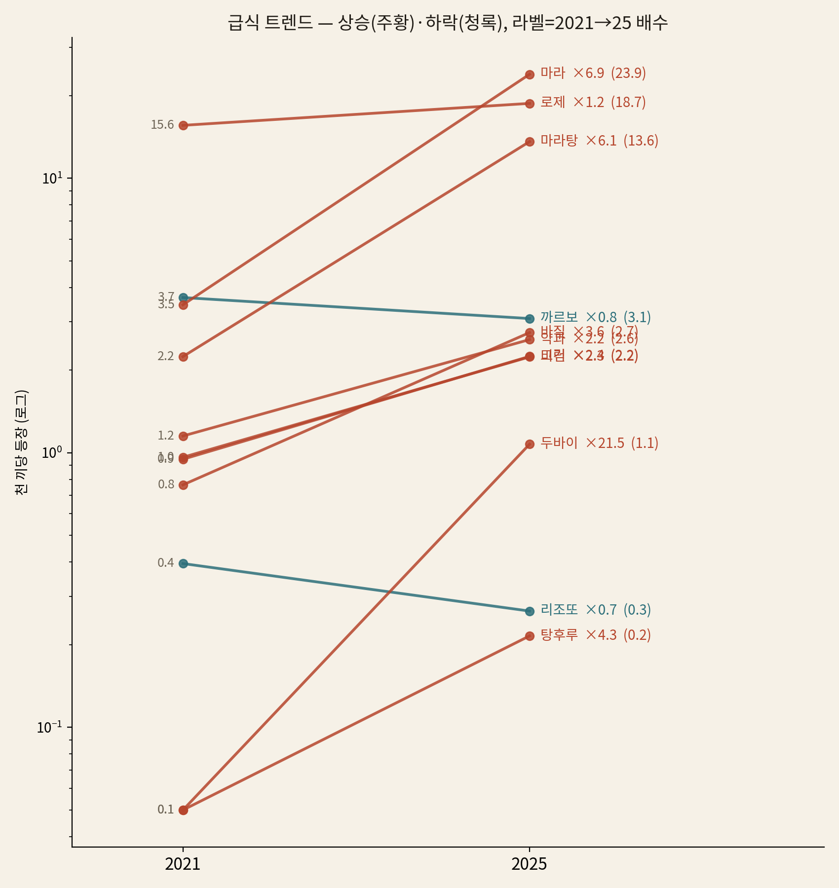
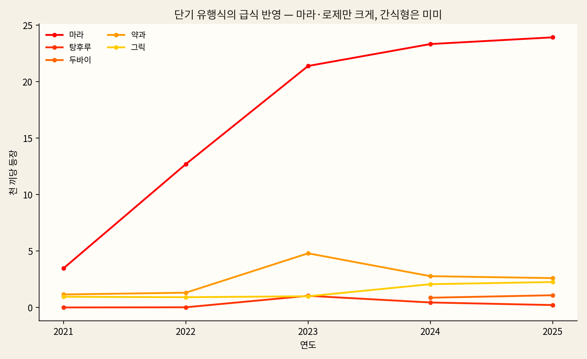
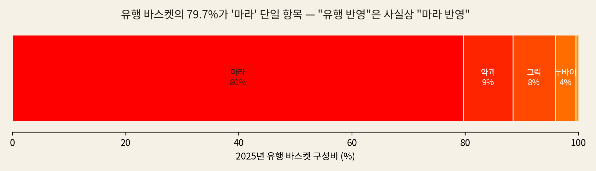
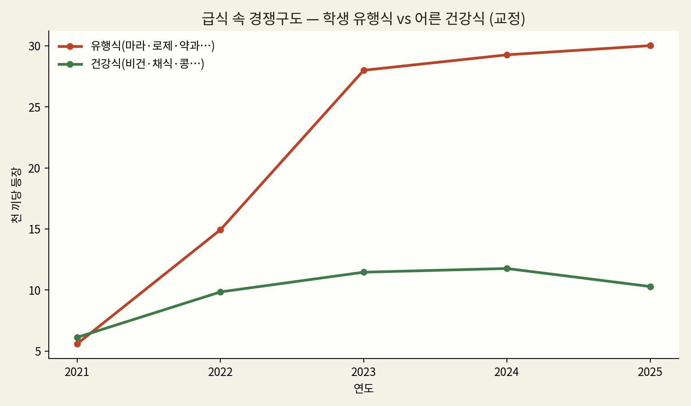
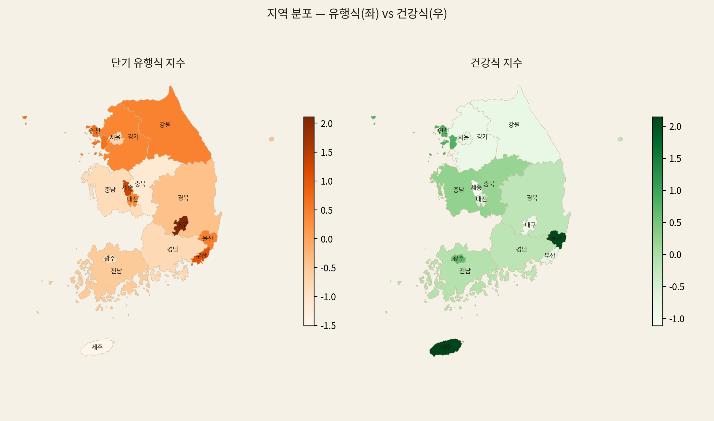
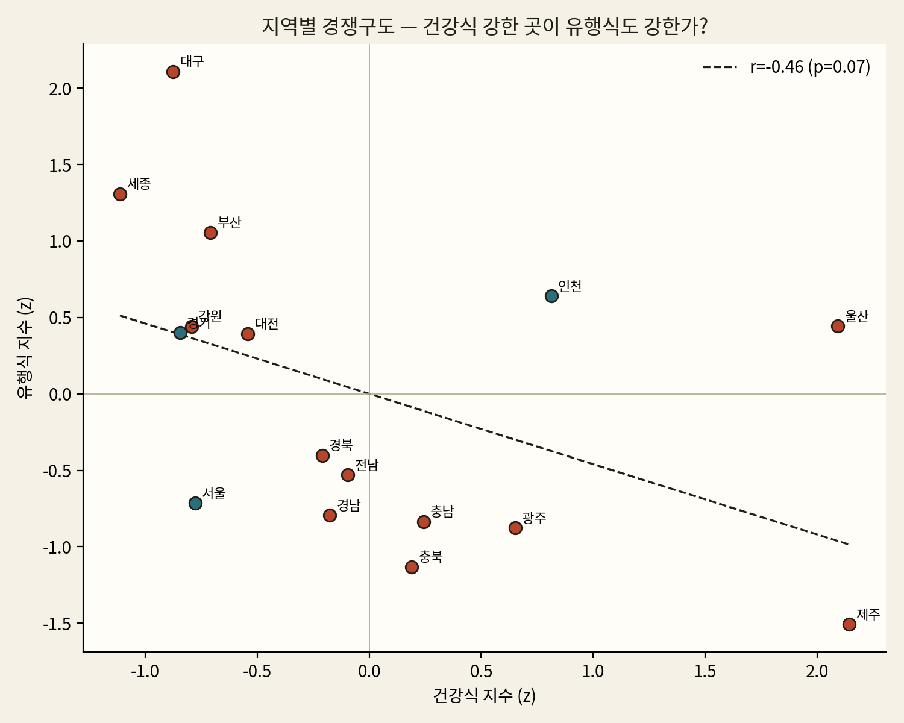
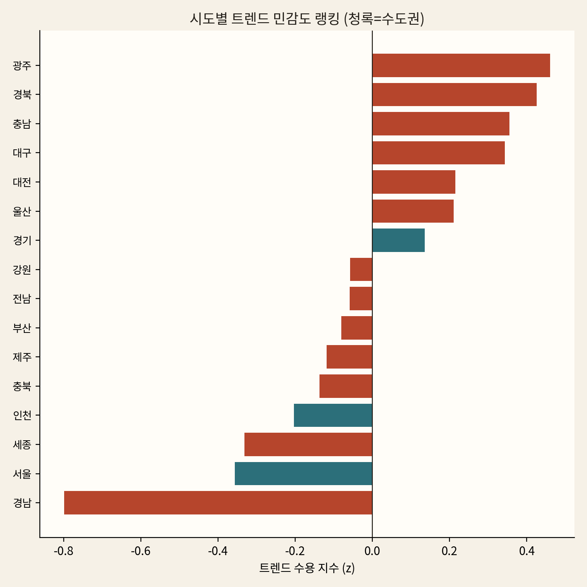
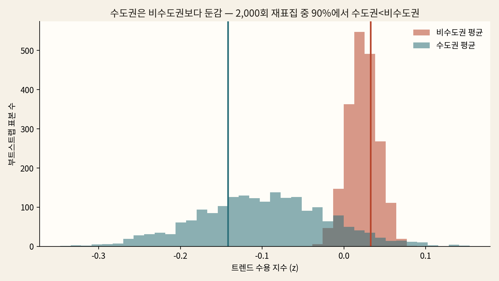
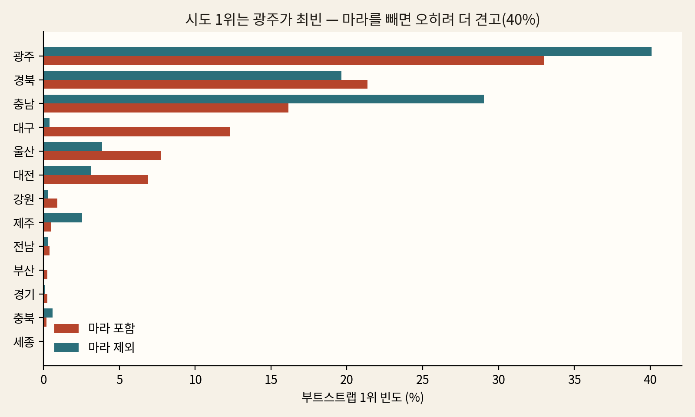
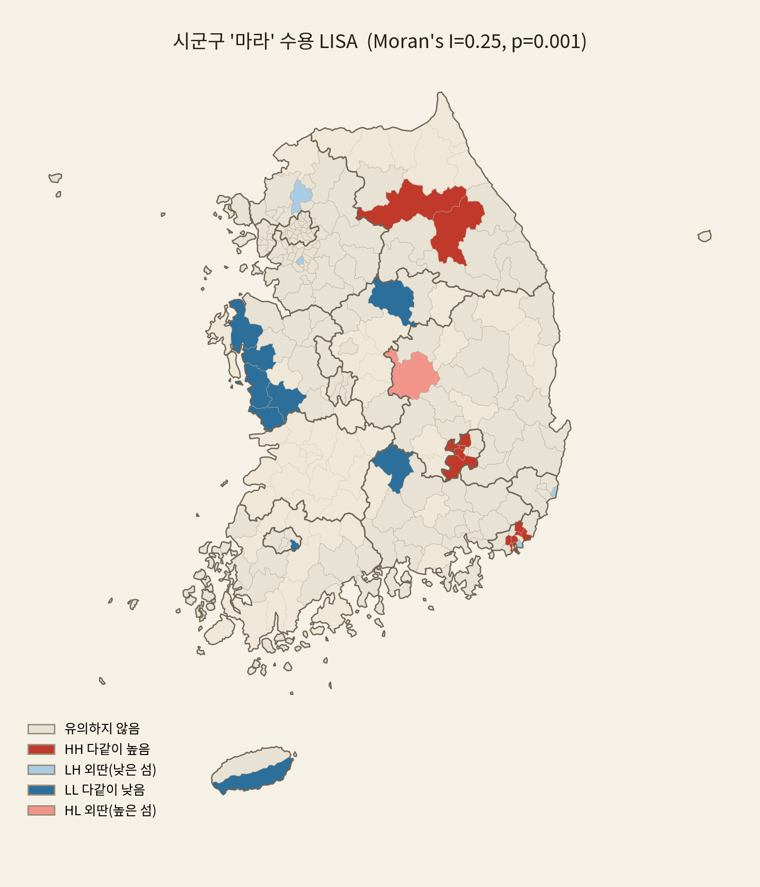

# 급식과 음식 트렌드 — 분석부터 역학, 그리고 검증까지

전국 고등학교 **중식(점심)** 식단을 NEIS에서 모은 **2,355개교 · 약 220만 끼**(2021–2025) 데이터로,
다음 한 질문을 끝까지 추적한 기록이다.

> **새로운 음식 유형이 유행할 때마다, 그 트렌드가 실제로 급식에 반영되는가?
> 식단을 짜는 어른(영양사)은 학생들의 음식 유행을 따라갈 수 있는가?**

분석 스크립트는 `temporal_analysis.py`(연도 트렌드)·`trend_reflection.py`(유행 반영·경쟁)·
`trend_sensitivity.py`(지역 민감도)이고, 검증 스크립트는 `verify_trends.py`다. 이 문서의 모든 수치는
**스크립트 재현 · 부트스트랩 · 외부 출처 대조**로 확인했다(§7).

### 한 줄 요약 — 상식이 세 번 다 빗나간다

답은 "어른이 정하니까"가 아니다(그건 당연하다). 흥미로운 건, 급식 트렌드에 대한 **상식 세 개가 데이터
앞에서 모두 빗나간다**는 것이다.

| 당연해 보이는 답 | 그런데 데이터는 | 진짜 이유 |
|---|---|---|
| 인기 많으면 급식에 → 탕후루가 마라보다 떴는데 | 마라는 들어오고 **탕후루는 안 들어옴**(발견1) | 인기가 아니라 **형태**(반찬이 되나) |
| 급식 비건이 적은 건 학생이 싫어해서 | **어른이 위에서 넣었다가** 학생이 거부해 멈춤(발견2) | 학생 수요가 아니라 **제도** |
| 트렌드는 서울·수도권이 먼저 | **광주·경북(지방)이 더 많이 받음**(발견3) | 입맛이 아니라 **예산** |

> **꿰뚫는 한 줄.** 급식에 뭐가 오를지는 **'맛·인기·도시'가 아니라 '형태·제도·예산'이 정한다.**
> §3–5가 세 번의 반전(*무엇이* 일어났나), §6이 그 세 가지 진짜 이유의 역학(*왜*), §7이 검증이다. 발견
> 절 끝의 *"→ §6.x"* 포인터가 각 반전을 그 원인으로 이어준다.

---

## 1. 질문 — 어른은 학생의 유행을 따라갈 수 있는가

2021–2025년 한국 청소년 사이에는 크게 세 갈래의 음식 유행이 있었다.

1. **단기 유행 식품** — 마라(마라탕·마라샹궈), 로제, 탕후루, 두바이초콜릿, 두쫀쿠, 버터떡, 약과 등.
   SNS·유튜브를 타고 몇 달 만에 떴다가 식는 '핫'한 메뉴들.
2. **헬시 플레저 / 대체식품** — 비건, 식물성, 콩고기, 두부 대체육 등. 건강·환경을 즐겁게 챙기는 흐름.
3. **건강·웰빙식** — 저탄소·채식 식단처럼 영양·기후 가치를 앞세운 음식.

학생은 이 유행의 **중심 세대**다. 유행에 가장 민감하고, 운동 열풍·비건 이슈에 접근이 빠르다. 그런데
**급식 메뉴를 짜는 사람은 학생이 아니라 어른(영양교사)이다.** 그래서 두 갈래로 나눠 묻는다.

- **(1) 단기 유행 식품**: 유행한 음식이 *유행 이후* 급식 출현 빈도가 얼마나 늘었나(시계열)? 그리고
  그 음식은 *어느 지역*에서 더 자주 나오나(맵핑)? — 흔한 예상은 "트렌드에 민감한 서울·수도권이 앞설
  것"이다. 데이터는 이 예상을 지지할까?
- **(2) 헬시 플레저(건강식·비건식)**: 건강식·비건식의 빈도는 어떻게 변했고, 학생 취향(유행식)과
  어른 가치(건강식)는 급식 안에서 어떤 **경쟁구도**를 보이나?

---

## 2. 데이터와 방법 — 키워드를 손으로 고르지 않고 임베딩으로 뽑는다

### 2.1 데이터
- `meals_lunch.parquet`: 학교코드·날짜(YYYYMMDD)·메뉴문자열(`ddish_nm`). 완전한 해 **2021–2025**만 사용
  (2026은 1~6월만 있어 계절·연도 비교에서 제외).
- `schools.parquet`: 학교코드·시도·주소. 분석은 끼 수가 충분한 **2,355개교**.
- **전북은 제외**한다 — NEIS에 전북 중식 데이터가 2024년부터만 있어 2021→2025 연도 비교가 불가능하다.
- 빈도는 항상 **천 끼당 등장률**로 잰다(`= 그 메뉴가 나온 끼 수 ÷ 전체 끼 수 × 1000`). 학교 수·식수
  차이를 지우고 지역·연도를 공평하게 비교하기 위해서다. 예) "마라 23.9"는 *천 끼 중 약 24끼에 마라가
  나온다*는 뜻.

### 2.2 키워드를 손으로 안 고르고 임베딩으로
유행·건강식 키워드를 손으로 나열하면 변형을 놓친다. 마라는 마라탕·마라샹궈·마라제육으로, 두바이초콜릿은
두쫀쿠·두바이쫀득초코떡으로 메뉴에 들어가는데, 이걸 일일이 적기 어렵다. 그래서 메뉴 텍스트로 학습한
**FastText 임베딩(`fasttext.model`)** 을 쓴다. FastText는 단어를 글자 조각(부분 n-gram) 단위로 학습해서
"마라"라는 조각을 공유하는 마라탕·마라샹궈를 **자동으로 가깝게** 배치한다.

단, 여러 시드를 평균한 중심 벡터로 한꺼번에 확장하면 매운맛(마라)과 디저트(탕후루)가 섞여 의미가 번지고
아이스크림 같은 상시 메뉴까지 딸려온다. 그래서 **root별로 좁혀** 다음 세 규칙으로 확장한다.

1. 구체적인 트렌드 단어를 **root(뿌리 단어)** 로 직접 큐레이션한다.
   - 유행 root: `마라·탕후루·두바이·약과·그릭·두쫀쿠·버터떡`
   - 건강 root: `비건·채식·식물성·콩고기·콩불고기·곡물불고기·두부까스·두부텐더`
2. 임베딩 확장은 **root별 최근접 변형만** 보탠다(중심 벡터 금지). 구체적으로 각 root에서 코사인
   유사도 ≥ 0.6, 등장 ≥ 30회이면서 **root 글자를 포함하는** 단어만 추가한다(약과 → 송편 같은 의미
   표류를 차단).
3. root를 포함하지 않는 **스테이플(상시 메뉴)** 은 stopword로 제외한다(아이스크림·마카롱·도넛·요거트·
   우유·쿠키·젤리·빙수 등).

이렇게 자동 확장한 최종 키워드 집합(실제 출력)은 다음과 같다.

| 카테고리 | 임베딩 확장 후 최종 키워드 |
|---|---|
| **유행식** | 마라·마라상궈·마라샹궈·딸기탕후루·아이스탕후루·탕후루·두바이·두바이초콜릿·두바이초콜렛·두바이쫀득초코떡·두바이쫀득볼·두바이쫀득쿠키·두바이초코마카롱·두바이초코케이크·두바이초코쿠키·두쫀쿠·약과·꿀약과·미니약과·찹쌀약과·그릭·버터떡·앙버터떡·상하이버터떡 |
| **건강식** | 비건·비건탕수육·채식·채식고추장·채식찐만두·식물성·콩고기·콩불고기·곡물불고기·두부까스·수제두부까스·두부텐더·두부텐더샐러드 |

**일부러 뺀 단어와 그 이유**:

- **로제·흑당·버블티**: 2021년에 이미 정착해 5년간 거의 평평(flat) → "2021–25 *신규* 유행"이 아니다.
  특히 로제는 바스켓을 지배해 진짜 마라의 급증세를 가렸다.
- **대체**: '대체'가 들어간 메뉴의 93%가 알레르기 *치환식*("우유 → 두유로 대체") 오탐.
- **두유**: '만두유린기'의 부분문자열 오탐 + 그 자체가 상시 메뉴(스테이플).
- **마라탕**: 지역 민감도 바스켓에서 '마라'의 부분집합이라 같이 넣으면 **이중 계수**가 된다.

---

## 3. 발견 1 — 마라는 되고 탕후루는 안 된다 (기준은 인기가 아니라 형태)

> **통념**: 인기 많으면 급식에 오른다. **데이터**: 탕후루가 마라보다 떴는데도 마라는 들어오고 탕후루는
> 안 들어왔다. **진짜 이유**: 인기가 아니라 '반찬으로 만들 수 있느냐(형태)'다.

 

연도별 등장률(천 끼당)과 그 추세 검정 결과는 다음과 같다.

| 메뉴 | 2021 | 2025 | 배수 | Mann-Kendall | CAGR |
|---|---:|---:|---:|---:|---:|
| 두바이초콜릿 | 0.00 | 1.07 | ×21.5 | 7 | — |
| **마라** | 3.46 | **23.91** | **×6.9** | **10** | **62%** |
| 마라탕 | 2.24 | 13.59 | ×6.1 | 10 | 57% |
| 탕후루 | 0.00 | 0.22 | ×4.3 | 4 | — |
| 바질 | 0.76 | 2.74 | ×3.6 | 10 | 38% |
| 그릭 | 0.95 | 2.24 | ×2.4 | 8 | 24% |
| 비건 | 0.96 | 2.24 | ×2.3 | 4 | 23% |
| 약과 | 1.15 | 2.58 | ×2.2 | 4 | 22% |
| 로제 | 15.58 | 18.73 | ×1.2 | −2 | 5% |
| 까르보나라 | 3.68 | 3.08 | ×0.8 | −10 | −4% |

> **표 읽는 법.** **배수**는 2021 대비 2025 등장률의 곱셈 변화(×6.9 = 약 7배). **Mann-Kendall(MK)** 은
> 5개 연도쌍의 증감 부호를 모두 더한 값으로, +10이면 *5년 내내 한 번도 안 꺾이고 단조 증가*(가장
> 강한 상승 신호), −10이면 단조 하락. **CAGR**(연평균 성장률)은 매년 평균 몇 % 늘었는지. 마라는
> 배수·MK·CAGR 셋 다 최상위 — 의심의 여지 없는 진짜 추세다.

**그러나 '배수'에 속으면 안 된다.** 두바이초콜릿은 ×21.5로 가장 큰 배수지만, *절대량*은 천 끼당 1.07로
거의 바닥이다(2021년이 0이라 배수가 폭발한 것). 탕후루도 ×4.3이지만 0.22로 사실상 없다. **절대량으로
보면 유행 바스켓은 마라가 지배한다.**

정제한 유행 바스켓의 **78.7%(2025년만 보면 79.7%)가 '마라' 한 항목**이다. 나머지는 약과 9% · 그릭 8% ·
두바이 4% 정도로, 탕후루·버터떡·두쫀쿠는 합쳐도 미미하다(`verify_trends.py`로 직접 집계).

> **결론 ①.** 어른들은 학생 유행을 따라가되, **밥·반찬으로 '메뉴화'할 수 있는 유행만** 흡수한다. 마라는
> 마라제육·마라탕·마라샹궈처럼 한 끼 반찬·국으로 번역돼 빠르게(×6.9) 들어왔다. 반대로 탕후루·두바이
> 초콜릿 같은 **간식·디저트형 유행은 급식에 거의 들어오지 못한다**(배수만 크고 절대량은 0에 가깝다).

이 발견은 데이터가 스스로 찾은 다른 변화와도 맞물린다. 같은 기간 **흰쌀밥(−0.78/년)·우유(−1.47/년)·
요구르트(−0.61/년)는 하락**하고, **귀리밥(+1.75/년)·혼합잡곡밥(+1.14/년)·잡곡밥(+0.92/년)은 상승**한다
— 정백(精白)에서 통곡(通穀)으로 가는 건강 지향의 신호다.

*왜 메뉴화 가능한 유행만 통과하는가? → §6.1 제도 필터.*

---

## 4. 발견 2 — 급식 비건은 학생이 원한 게 아니다 (맛 싸움이 아니다)

> **통념**: 급식에 비건·채식이 적은 건 학생이 싫어해서다. **데이터**: 어른(교육청)이 위에서 넣었다가
> 학생이 잔반으로 거부해 멈췄다. **진짜 이유**: 학생도 어른도 한쪽 선호만으론 못 이긴다 — 둘 다 정체.

 

학생 취향(유행식)과 어른 가치(건강식: 비건·채식·콩고기·두부 대체)가 급식 안에서 경쟁한다. 둘의 전국
등장률(천 끼당)을 해마다 보면 이렇다.

| 연도 | 2021 | 2022 | 2023 | 2024 | 2025 | 2021→25 |
|---|---:|---:|---:|---:|---:|---:|
| **유행식** | 5.6 | 14.9 | 28.0 | 29.3 | 30.0 | **×5.4** |
| **건강식** | 6.1 | 9.8 | 11.5 | 11.8 | 10.3 | **×1.7** |

- 2025년 기준 **유행식이 건강식의 약 2.9배**다. 다만 *압도*는 아니다 — 건강식도 ×1.7로 꾸준히 는다
  ('저탄소 채식의 날' 같은 제도적 노력의 흔적, §6.3).
- 중요한 공통점: **둘 다 2023년 이후 성장이 멈춘다.** 유행식은 급증세가 꺾여 정체(28.0 → 29.3 → 30.0),
  건강식은 **2024년 정점(11.8) 후 하락**(→ 10.3). 폭발하던 두 곡선이 약속이라도 한 듯 같은 해에 평평해진다.

**지역 분포**(위 오른쪽 지도)를 보면 유행식은 영남·수도권 일부에서, 건강식은 부산·제주·호남에서 상대적
으로 높다.

지역 단위에서 건강식과 유행식은 **약한 trade-off**(음의 상관, r = −0.46, p = 0.07)를 보인다 — 유행을
좇는 곳(세종·대구)이 건강식엔 다소 소극적인 경향. 단 통계적으로 약하고(제주 1곳을 빼면 무너진다),
"유행을 좇으면 건강을 버린다"고 단정할 정도는 아니다.

*왜 건강식은 더 느리고, 왜 둘 다 2023에 멈추는가? → §6.3 양방향 거울.*

---

## 5. 발견 3 — 트렌드를 더 많이 받는 건 서울이 아니라 지방

> **통념**: 트렌드는 도시·수도권이 먼저 받는다. **데이터**: 광주·경북(지방)이 더 많이 받고 서울은
> 둔감하다(*수준+증가량* 기준 — '시간상 먼저'를 잰 게 아님). **진짜 이유**: 입맛이 트렌디해서가
> 아니라 친환경 급식 '예산'이 지방에 더 많아서다(§6.2, 질적).

 

유행 메뉴 바스켓(마라·두바이·탕후루·약과·그릭·바질·비건)을 각 시도가 얼마나 받아들였는지를 하나의
**트렌드 수용 지수**로 요약했다. 지수 = *2025년 수용 수준*과 *2021→2025 증가 속도*를 각각 z-점수(전국
평균=0, 표준편차=1)로 바꿔 평균한 값이다(양수 = 평균보다 민감, 음수 = 둔감).

| 시도 | 수용지수 | 2025 바스켓 | 증가 | | 시도 | 수용지수 | 2025 바스켓 | 증가 |
|---|---:|---:|---:|---|---|---:|---:|---:|
| 광주 | **+0.46** | 34.6 | +30.4 | | 제주 | −0.12 | 28.4 | +23.0 |
| 경북 | **+0.43** | 35.5 | +30.6 | | 충북 | −0.14 | 30.1 | +22.1 |
| 충남 | +0.35 | 32.9 | +25.9 | | 인천(수) | −0.20 | 36.5 | +26.1 |
| 대구 | +0.34 | 43.6 | +37.4 | | 세종 | −0.33 | 38.6 | +28.4 |
| 대전 | +0.21 | 36.1 | +29.6 | | **서울(수)** | **−0.36** | 32.5 | +24.7 |
| 울산 | +0.21 | 46.6 | +29.7 | | **경남** | **−0.80** | 30.4 | +24.1 |
| 경기(수) | +0.14 | 36.2 | +28.4 | | (강원·전남·부산은 −0.06~−0.08) | | | |

- 민감 상위는 **광주·경북·충남·대구 — 지방(호남·영남)** 이다. 둔감은 **경남·서울**.
- **수도권 평균 −0.14 < 비수도권 평균 +0.03.** 서울에서 멀수록 둔감해야 한다는 "도시=리더" 가설이
  맞다면 서울과의 거리는 음의 상관이어야 하는데, 실제는 **무상관**(r = +0.07, p = 0.81). 즉 **"도시·
  수도권이 트렌드 리더"라는 통념을 데이터가 기각한다.**

### 5.1 이 역설이 진짜인지 — 부트스트랩으로 흔들어 본다
지수는 표본(어떤 학교가 뽑혔나)에 따라 흔들릴 수 있다. 그래서 **시도 안에서 학교를 복원추출(중복 허용
재표집)** 해 지수를 2,000번 다시 계산했다(이를 *부트스트랩*이라 한다 — "같은 모집단에서 다시 뽑으면
결론이 유지되나?"를 보는 방법). 재현 가능하도록 난수 seed를 고정했다(`verify_trends.py`).

위 그림은 2,000번의 재표집에서 나온 *수도권 평균*(청록)과 *비수도권 평균*(주황) 지수의 분포다. 두 분포가
거의 갈라져 있고, **재표집의 90%에서 수도권 평균 < 비수도권 평균**이었다(바스켓에서 마라를 빼면 93%로
더 견고). 즉 **수도권이 둔감하다는 광역 방향은 견고하다.**

반면 **시도 *1위* 순위 자체는 불안정하다** — 부트스트랩에서 1위로 뽑힌 빈도는 광주 33% · 경북 21% ·
충남 16% · 대구 12%로, 한 시도가 압도하지 않는다. 다만 **최빈 1위는 광주**이고, 흥미롭게도 **마라를
빼면 광주가 40%로 오히려 더 견고**해지며 대구는 9위로 후퇴한다. 즉 *대구의 상위 순위*가 마라 단일
유행에 의존했고, *광역 방향(수도권 둔감)* 과 *광주 선두*는 마라와 무관하게 견고하다.

### 5.2 어떤 유행이 지역색이 강한가
유행별 2025년 지역 편차(CV = 표준편차/평균, 클수록 지역적)를 보면:

| 유행 | CV | 최고 시도 |
|---|---:|---|
| 비건 | 0.86 | 울산(10.2) |
| 탕후루 | 0.79 | 충남(0.5, 소표본) |
| 두바이 | 0.45 | 충남(1.8) |
| 바질 | 0.40 | 경북(4.5) |
| **마라** | **0.19** | 대구(33.5) |

대형 유행(마라 CV 0.19)은 **전국이 고르게** 받아들이고, 틈새 유행(비건·바질)만 지역색이 강하다.

### 5.3 '평균·줄세우기'를 넘어 — 진짜 공간통계 (Moran's I · LISA)
시도 평균 비교만으론 "엑셀 피벗이지 공간분석이 아니다"라는 비판을 받는다 — *인접한 지역끼리 실제로
닮았는지*는 공간통계로 따로 검정해야 한다. 그래서 유행을 **시군구 187개(≥5교, 2025)** 로 내려 인접
(Queen) 가중치 위에서 공간 자기상관을 검정했다(`trend_spatial.py`). 먼저 **무엇이 공간 구조를 만드는지**
분해했다(Global Moran's I, 순열 999회).

| 대상 | Moran's I | p | 판정 |
|---|---:|---:|---|
| **마라 단독** | **+0.26** | **0.001** | 공간 군집(유의) |
| 비마라 유행 6종 | +0.03 | 0.28 | 군집 없음 |

유행 바스켓의 공간성은 **마라 한 항목이 거의 전부 만든다** — 나머지 6종(두바이·탕후루·약과·그릭·바질·
비건)은 공간적으로 흩어져 있다. 바스켓 등장의 69%가 마라라(§5 공간 바스켓은 바질·비건을 더 포함해
§3 정제 바스켓의 78.7%보다 낮다), **트렌드의 지리는 곧 마라의 지리**다.

- **마라 수용은 무작위가 아니라 공간적으로 군집한다(Moran's I = +0.26, p = 0.001).** LISA 핫스팟(HH)
  14곳 중 **12곳이 부산·대구(영남 대도시)**, 2곳은 강원 농촌(평창·홍천); 콜드스팟(LL)은 충남 농촌.
  *피벗이 아니라 검정된 공간 구조다.*
- **그런데 이 공간은 '매운맛 식문화'의 공간이 아니다.** 마라 핫스팟과 §1의 매운맛 핫스팟은 **거의 겹치지
  않는다**(공통 14곳 중 4곳뿐, 두 지도를 나란히 보면 분명하다). 매운맛 핫스팟은 영남·호남 **농촌**인데
  마라는 대도시다 — 둘은 사실상 무관하다(r=−0.18). 마라는 향토 식문화가 아니라 **도시 외식 트렌드**의
  지리다. *즉 같은 걸 두 번 말하는 게 아니다.*

*트렌드의 지리는 식문화의 지리와 다르다 — 왜 하필 부산·대구인가는 데이터 한계로 단정하지 않는다(§9).*

---

## 6. 왜 그런가 — 역학 (Dynamics)

§3–5의 세 반전(*무엇*)은 데이터로 끝났다. 그 **진짜 이유 — 형태·제도·예산**(*왜*)은 우리 데이터 *밖*,
급식 시스템에 있어 정부 법령·교육청 자료·학술 논문·언론을 다중 출처로 조사했다. 셋을 한 줄로 묶으면 —
**급식은 학생 입맛이 아니라 시스템(규칙·돈)으로 굴러간다.** 아래 §6.1이 '형태'(발견1), §6.3이 '제도'
(발견2), §6.2가 '예산'(발견3)의 역학이다. (네 패턴 전체의 교차분석은 [`DYNAMICS.md`](DYNAMICS.md).)

### 6.1 왜 '메뉴화 가능한 것'만 통과하나 — 제도 필터 (발견 1)

급식은 '그날 학생이 먹고 싶은 것'이 아니라 **전달에 편성·계약으로 고정된 균형 한 끼**다. 세 겹의 제도가
간식형 유행을 구조적으로 걸러낸다.

1. **영양관리기준(학교급식법 시행규칙 별표3)** — 식단 작성 시 **"염분·유지류·단순당류·식품첨가물의
   과다 사용 금지"** 를 못박고, 한 끼가 에너지 기준 ±10%, 탄수화물:단백질:지방 = 55~70 : 7~20 : 15~30%,
   비타민·칼슘·철을 권장섭취량 이상으로 채우게 한다. 탕후루(설탕 코팅)·두바이초콜릿은 본질이 단순당류
   덩어리라 이 작성 원칙과 영양 비율을 동시에 위반해 **한 끼 식단의 구성요소가 될 수 없다.** 반대로
   마라는 단백질·채소를 낀 반찬·국으로 메뉴화돼 이 필터를 통과한다.
2. **조달의 월 단위 경직성** — 식재료는 식품군별로 매월 입찰해 **매월 27일 이전 계약 체결**을 끝내고,
   재계약 여부도 매월 20일 전에 정한다. 즉 다음 달 메뉴는 전달에 식재료 계약으로 사실상 확정되어,
   유행이 떠도 즉시 끼워 넣을 여유가 없다.
3. **간식 규제(어린이 식생활안전관리 특별법 제8조)** — 학교(및 우수판매업소)에서 고열량·저영양 식품
   (과자·캔디류·**초콜릿류**·빙과)의 *판매*를 제한한다. 학교 환경 전반이 고당 간식을 밀어내는 기조다.
   *(정직한 한계: 이 법은 '판매'를 규율하며 '식단 편성'을 금지하는 조항은 아니다 — 더 직접적인 근거는
   1의 별표3 단순당류 제한이고, 특별법은 그 기조의 방증이다.)*

같은 '사전 고정' 구조가 급식의 또 다른 특징도 설명한다 — 급식은 **'그날의 날씨'에 반응하지 않는다**
(계절을 제거하면 기온 이상치와 국물·냉면 비중의 상관이 r≈0). 메뉴가 전달에 고정되니, 실시간 날씨도
실시간 유행도 못 따라가는 것이다.

### 6.2 왜 도시가 아니라 지방이 민감한가 — 재정 인센티브 (발견 3)

수도권 역설의 가장 견고한 설명은 **지역의 급식 예산 차이**다. 시도는 급식 식품비 본단가에 더해 친환경·
로컬푸드 식재료를 **추가 지원**하는데, 그 단가가 지역마다 크게 갈린다.

- 추가지원 단가: **경북 1,084원 · 전남 803원 · 인천 554원 vs 서울·부산 0원.** 우리 데이터의 민감 시도
  (경북·충남·광주)와 추가지원 상위 지역이 겹치고, 둔감의 서울과 추가지원 0이 대응한다.
- 전남은 2026년 친환경 식재료 **차액 지원에만 약 393억 원**을 무상급식과 별도로 투입한다. 반대로 서울은
  친환경 농산물 권장 비율을 70→50%로 **낮췄다**.
- 즉 추가 예산이 있는 지방일수록 영양교사가 향토·신규·유행 식재료를 편성할 **여력**이 크다. *도시가
  아니라 예산이 메뉴 실험의 여력을 좌우한다*(인과가 아닌 질적 상관 — 부산 0원처럼 반례도 있음, §9).

조달 구조도 이를 보강한다 — 수도권은 광역 표준화 공급(서울 친환경유통센터가 대상 학교의 66%, 경기
우수농축산물 체계가 도내 95%에 일괄 공급)이 강한 반면, 지방은 시·군 급식지원센터가 *지역산 품목
다양성*을 공급한다. *(반례: 경남은 둔감인데도 무상급식이 강해, 재정 단일 변수로는 설명되지 않는다.)*

### 6.3 왜 건강식이 뒤처지고 둘 다 정체하나 — 양방향 거울 (발견 2)

건강식·비건이 더 느린 이유는, **그것이 학생이 미는 게 아니라 제도가 위에서 미는(top-down) 음식**이기
때문이다.

- **언제·누가 밀었나**: 광주가 **2011년 전국 최초** '주1회 채식의 날'을 도입(명분 = 환경친화·전통
  식생활, 2021년 '저탄소 식단의 날'로 개명)한 뒤, 2019–21년 전국 교육청으로 확산했다(울산 '고기 없는
  월요일', 서울 'SOS! 그린급식' 월 2회, 부산·인천·경남). 조례로도 박혔다(제주 2022.3 — 주1회 완전채식 +
  채식선택권, 부산 2021). 탄소중립 시범학교가 **102교(2021) → 238 → 340교(2023)** 로 늘고 전남은 전체
  학교 페스코 식단을 의무화했다. 압력 주체는 교육청·환경부·녹색당·소비자기후행동·채식급식시민연대로
  **모두 성인·제도**다. 학생 유행이 SNS 입소문(bottom-up)인 것과 정반대다.
- **왜 멈췄나**: 제도가 밀어도 **학생 입맛이 거부하면 멈춘다.** 채식의 날 잔반이 **30~40% 증가**하고
  (인천 영양교사), 만족도 조사 1.4만 명 중 **33%가 불만**, 강원(춘천)은 반대 57.9%였다. 영양 우려
  (성장기 단백질·B12·철 결핍, 식품영양학 교수·축산단체)가 2차로 정당화하며, 여러 지역이 의무에서
  **'채식선택제'로 후퇴**했다(서울 2024 등). 즉 건강식의 정체는 수요가 사라져서가 아니라 **제도가
  페달에서 발을 뗀** 결과다.

여기서 두 음식이 정확히 **거울상**이라는 게 드러난다.

| | 미는 힘 | 거르는 필터 | 결과 |
|---|---|---|---|
| **유행식**(마라·탕후루) | 학생 (bottom-up) | **제도** — 영양기준·사전편성(§6.1) | 메뉴화 가능한 마라만 통과 |
| **건강식**(비건·채식) | 제도 (top-down) | **학생 입맛** — 잔반↑ | 의무 → 선택으로 후퇴 |

성장률 격차(×5.4 vs ×1.7 ≈ 2.9배)는 **bottom-up 입소문 속도 vs top-down 행정 보급 속도**의 차이로 읽히고,
둘 다 2023에 멈춘 것은 우연이 아니라 **각기 다른 필터(유행 = 영양 제도, 건강 = 학생 입맛)에 동시에
걸렸기** 때문이다. **급식은 학생도 어른도 일방적으로 못 짜는, 두 힘이 서로의 필터를 통과한 합의점이다.**

> **단서.** "건강식 = 순수 top-down"은 약간 과하다. 채식주의자·질환이 있는 학생·학부모가
> 직접 인권위에 '채식 선택권'을 진정한 *소수 bottom-up* 은 실재한다. 정확히는 — "전교 의무 채식의 날"은
> 교육청 top-down, "선택권 보장"은 일부 당사자의 자발적 요구로 **층위를 구분**해야 한다. 또 "학생이 무조건
> 거부"가 아니라 **"준비 없는 강제만 거부"** 다: 환경교육·채식요리 실습·텃밭·생태전환교실을 함께 운영한
> 인천 채식 선도학교 6곳은 찬성 81%로 반등했다.

---

## 7. 검증 — 수치는 어떻게 확인했나

이 문서의 수치는 세 가지 방법으로 확인했다.

- **데이터 재현**: 세 분석 스크립트를 다시 돌려 핵심 수치(마라 ×6.9·MK 10·CAGR 62%, 두바이 ×21.5,
  유행:건강 2.9배, 광주 +0.46·경북 +0.43, 서울거리 r=+0.07 p=0.81)를 확인했다.
- **부트스트랩 재표집**: 유행 바스켓 마라 비중(78.7%), 수도권 둔감(재표집의 90%, 마라 제외 93%), 시도
  1위 빈도(광주 33%, 마라 제외 40%)를 `verify_trends.py`로 직접 계산했다(§3·§5 그림). seed를 고정해
  같은 결과가 재현된다.
- **외부 출처 대조**: §6 역학의 제도·정책 사실(별표3 단순당류 금지·매월 27일 계약·추가지원 경북 1,084/
  전남 803/서울 0·전남 차액지원 약 393억·2011 광주 채식의 날·잔반 30~40%·탄소중립 102→340교·인천 채식
  선도학교 6곳 81%)을 정부·교육청·학술·언론 원문과 대조해 확인했다(아래 §출처).

키워드도 임베딩 자동 확장 그대로 쓰지 않고 빈도·추세를 점검해, 이미 정착한 메뉴(로제)와 오탐(대체·두유)을
제외했다(§2.2).

---

## 8. 결론

세 가지 상식이 데이터 앞에서 모두 빗나갔다.

1. **인기 많다고 급식에 오는 게 아니다 — 형태다.** 마라는 반찬이 되니 빠르게(×6.9) 들어왔지만, 더 떴던
   탕후루·두바이초콜릿은 간식이라 거의 못 들어온다(유행 바스켓의 80%가 마라).
2. **건강식은 학생이 원해서가 아니다 — 제도다.** 어른(교육청)이 위에서 밀어 늘렸다가 학생이 잔반으로
   거부해 멈췄다. 학생 유행도 어른 건강식도 한쪽 선호만으론 못 이겨, 둘 다 2023 이후 정체한다.
3. **트렌드를 더 많이 받는 건 수도권이 아니다.** 시도 수준에서 수도권은 둔감하고(부트스트랩 90%), 시군구
   수준에서 마라는 **부산·대구(영남 대도시)에 공간적으로 군집**한다(Moran's I=+0.26, p=0.001) — 유행의
   급식 반영은 균질하지 않다. *왜* 하필 거기인지(예산·외식 환경 등)는 데이터로 단정하지 않는다(§9).

> **급식에 뭐가 오를지는 '맛·인기·도시'가 아니라 '형태·제도·예산'이 정한다.** 그래서 우리의 상식이
> 세 번 다 빗나간다.

> **지리적 결론.** 유행이 급식에 닿는 데에는 공간이 작동한다 — 마라(유행의 약 70%)는 부산·대구
> 대도시에 통계적으로 군집하고(Moran's I=0.26, p=0.001), 그 핫스팟은 향토 매운맛 식문화(농촌)의
> 핫스팟과 거의 겹치지 않는다(공통 14곳 중 4곳). 마라는 식문화가 아니라 **'도시 외식 트렌드의 지리'**다
> — 유행의 급식 반영은 균질하지 않고 *공간을 탄다.*

## 9. 한계

- 유행 바스켓의 약 80%가 마라라, "유행 반영"은 사실상 **"마라 반영"** 으로 읽어야 한다.
- 시도별 1위 순위는 마라 단일 유행에 민감해 불안정하다 — 견고한 것은 광역 방향(수도권 둔감)과 광주 선두다.
- 건강식 키워드는 비건/채식 중심이라 '웰빙·영양' 전체를 포괄하지 않고, 두부·콩 같은 **전통 식자재**가
  섞여 채식 정책 신호를 과대추정할 수 있다.
- §6의 역학은 대부분 인과 실험이 아닌 **상관**이다(추가지원 → 편성, 정책 타임라인 → 정체). 경남 둔감은
  단일 가설로 설명되지 않는 미해소 반례다.
- **공간 단위(MAUP)**: 시도(거시)와 시군구(미시)의 그림이 다르다 — 단위를 바꾸면 패턴이 바뀐다. 트렌드의
  공간 군집은 사실상 **마라 하나**가 만들며(비마라 유행은 군집 없음, I=+0.03 p=0.28), 왜 부산·대구인지는
  데이터로 단정하지 않는다.
- **예산 데이터 한계**: 17개 시도 전체의 친환경 추가지원 단가가 공개되지 않아(5개 시도만 확인) 예산을
  *공간변수로* 분석하지 못했다 — §6.2의 예산 설명은 일부 시도 사례에 근거한 **질적 해석**이다. 서울거리
  검정도 유클리드 직선거리 한정(교통망·통행시간 미반영).
- NEIS는 2021년부터만 제공한다 — 유행 *직전* baseline(2019–2020)이 없어 '유행 이후 증가'의 기준연도가
  2021로 고정된다.

---

## 출처

§3–5의 **데이터 수치**는 외부 출처가 아니라 스크립트 재실행·부트스트랩으로 재현된다(아래 '재현'). 외부
출처는 §6 **역학(why)** 의 제도·정책 사실에 대한 것이며, §7의 외부 출처 대조로 원문을 확인했다.

**§6.1 제도 필터**
- 찾기쉬운 생활법령정보 — 학교급식 운영·관리(급식법 제11조, 시행규칙 별표2·3 단순당류·영양기준) · 법제처 — https://easylaw.go.kr/CSP/CnpClsMain.laf?popMenu=ov&csmSeq=1113&ccfNo=3&cciNo=1&cnpClsNo=1
- 찾기쉬운 생활법령정보 — 학교 주변 고열량·저영양 식품 판매 금지(어린이 식생활안전관리 특별법 제8조) — https://easylaw.go.kr/CSP/CnpClsMain.laf?popMenu=ov&csmSeq=670&ccfNo=2&cciNo=2&cnpClsNo=2
- 식품안전나라(식약처) — 고열량·저영양 식품 영양성분 판정 기준 — https://www.foodsafetykorea.go.kr/hilow/content/view.do?contentKey=1
- 광주광역시교육청 — 식재료 계약 방법(월별 입찰·매월 27일 계약·분리발주) — http://food.gen.go.kr/sub/page.php?page_code=food_05
- 광주광역시교육청 — 영양관리기준(에너지 ±10%, 탄단지 55~70:7~20:15~30) — http://food.gen.go.kr/sub/page.php?page_code=life_02

**§6.2 재정 인센티브**
- KREI — 학교급식 식재료 조달체계 연구(NKIS) — https://www.nkis.re.kr/subject_view1.do?otpId=KREI00019915&otpSeq=0&popup=P
- 서울특별시 — 2025 친환경 학교급식 식재료 관리·공급체계(친환경유통센터 66%) — https://news.seoul.go.kr/welfare/archives/400172
- 내외일보 — 경기도 우수농축산물 공급, 도내 학교 95% 참여 — https://www.naewoeilbo.com/news/articleView.html?idxno=2333606
- 인천투데이 — 학교급식 단가 지역차(추가지원 경북 1,084·전남 803·인천 554·서울/부산 0원) — https://www.incheontoday.com/news/articleView.html?idxno=220446
- 서울뉴스통신 — 전남도 2026 학교급식 친환경 차액지원 약 393억 — http://www.snakorea.com/news/articleView.html?idxno=1002416
- 복지로/보도 — 서울 학교 친환경 농산물 권장 사용비율 70→50% 하향 — https://www.bokjiro.go.kr/ssis-tbu/cms/pc/news/news/6100865.html

**§6.3 양방향 거울(경쟁구도)**
- 팜인사이트 — 학교 채식운동 현황과 과제(광주 2011 전국 최초·전국 확산 연혁·강원 설문) — https://www.farminsight.net/news/articleView.html?idxno=7600
- 경향신문 — '채식'이라더니 고기반찬…겉도는 제주 '채식급식 조례'(2022.3.4 시행·이행률) — https://www.khan.co.kr/article/202211062142055
- 부산광역시교육청 — 학교 채식급식 활성화 조례·운영(2021) — https://www.pen.go.kr/main/na/ntt/selectNttInfo.do?mi=31073&bbsId=2585&nttSn=1096305
- 한국일보 — 채식연대 "군 부대처럼 학교 급식에도 채식 식단"(인권위 진정 2021.6.4, 학생·학부모 당사자) — https://www.hankookilbo.com/News/Read/A2021060414180002289
- 환경부 보도자료 — 탄소중립 시범학교 102→238→340교 — https://me.go.kr/home/web/board/read.do?boardId=1492910&boardMasterId=1&menuId=286
- 대한급식신문 — 전남 '저탄소 학교급식'(2021 시범 80교→전체·매월 페스코) — https://www.fsnews.co.kr/news/articleView.html?idxno=45521
- 아시아경제 — [소비자기후행동] 학교 채식급식 보장해 기후위기 극복 — https://www.asiae.co.kr/article/2022060912162878594
- 한국경제 — 고기 없는 월요일…학교 채식 급식 논란(영양·성장 우려, 원광대 이영은 교수) — https://www.hankyung.com/article/2021040837591
- 경기일보 — 인천 채식급식 잔반 30~40%·만족도 33% 불만(1.4만 중 4,836명, 2022.2) — https://www.kyeonggi.com/article/202202063673570
- 전북일보 — 학교 '채식의 날' 영양균형 vs 잔반 증가(2020) — https://www.jjan.kr/article/20200114702324
- 코메디닷컴 — 성장기 어린이 완전채식 영양(B12·단백질 결핍 위험, 연구 종합) — https://kormedi.com/2774654/
- 대한급식신문 — '채식선택제', 결국 더 신중한 판단 필요(서울 2024 등 의무→선택 전환) — https://www.fsnews.co.kr/news/articleView.html?idxno=38743
- 오마이뉴스 — 채식급식 날은 매점 가는 날?(잔반·기호도 + 인천 반등 맥락) — https://www.ohmynews.com/NWS_Web/View/at_pg.aspx?CNTN_CD=A0002819868
- 축산신문 — (기고) 성장기 학생들 선택권 없는 급식의 문제점(이해관계자 반대) — https://chuksannews.co.kr/news/article.html?no=240754
- 유스저널 — 인천 채식 선도학교 6곳 응답자 81% 찬성(환경교육·채식요리·텃밭 운영, 2022.7) — https://www.usjournal.kr

**재현(데이터 수치)**: `temporal_analysis.py`(연도 트렌드)·`trend_reflection.py`(유행 반영·경쟁)·
`trend_sensitivity.py`(지역 민감도)·`verify_trends.py`(마라 비중·부트스트랩 90%·1위 빈도). 부트스트랩은
seed 고정(20260605)이라 동일 결과가 재현된다.

---

*관련 문서: 전체 발견 요약 [`README.md`](README.md) · 방법론(프로세스 4종) [`METHODS.md`](METHODS.md) ·
역학 교차분석 [`DYNAMICS.md`](DYNAMICS.md) · 진행 로그 [`docs/PROGRESS.md`](docs/PROGRESS.md).*
