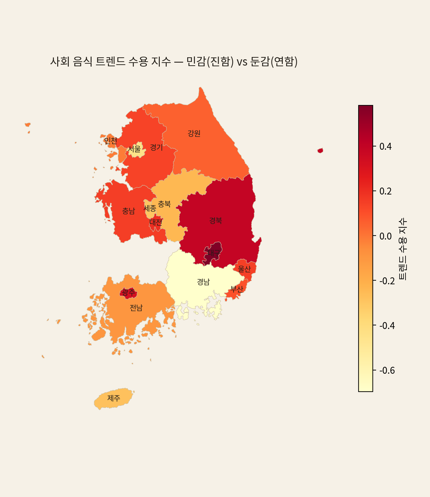

# 새 음식 유행은 급식에 반영되는가? — 학생 유행 vs 어른 식단

> NEIS 전국 고교 중식 **2,355개교 · 약 220만 끼**(2021–2025) 분석.
> 분석·시각화: `trend_reflection.py`, `trend_sensitivity.py`. 모든 수치는 **5라운드 적대검증**을 통과했다.

---

## 1. 질문

2021–2025년 사이 한국에는 세 갈래 음식 유행이 있었다.

- **단기 유행 식품**: 마라, 로제, 탕후루, 두바이초콜릿, 두쫀쿠, 버터떡, 약과 …
- **헬시 플레저 / 대체식품**: 비건, 식물성, 콩고기, 콩단백 …
- **건강·웰빙식**: 영양·저탄소 식단 …

학생은 이 유행의 **중심 세대**다 — 유행에 가장 민감하고, 운동 열풍·비건 이슈에 접근이 빠르다.
그러나 **급식 메뉴를 짜는 것은 어른(영양사)이다.** 그래서 묻는다:

> **어른들은 학생들의 음식 유행을 따라갈 수 있는가?** 새 유행이 뜰 때마다 급식에 실제로 반영되는가?

---

## 2. 데이터와 방법

### 키워드를 손으로 나열하지 않고 — FastText 임베딩으로 추출
메뉴 텍스트로 학습한 `fasttext.model`에서 각 카테고리 시드(마라·비건 등)와 **임베딩이 가까운 메뉴를
자동 확장**한다. 손 리스트가 놓치는 변형(마라→마라샹궈·마라탕면, 두바이→두쫀쿠·두바이쫀득초코떡,
비건→채식만두·콩불고기·곡물불고기)을 데이터에서 발굴한다.

### 그러나 임베딩에도 함정이 있었다 — 5라운드 적대검증
초판은 시드들의 **'중심 벡터'** 확장이라 *마라(매운)+탕후루(디저트)+요거트(유제품)* 가 섞여
**"디저트 일반"으로 표류** → 아이스크림(3.7만 건)·마카롱·도넛이 '유행식'을 지배했다. 이후 독립 감사자가
5라운드에 걸쳐 구멍을 잡고 고쳤다(§6). 최종 키워드 집합:

| 카테고리 | 추출 키워드(임베딩 확장 후, 정제) |
|---|---|
| 유행식 | 마라·마라샹궈·마라탕·딸기탕후루·아이스탕후루·두바이초콜릿·두바이쫀득초코떡·두쫀쿠·약과·꿀약과·그릭·버터떡 … |
| 건강식 | 비건·비건탕수육·채식만두·채식비빔밥·채식육개장·식물성·콩고기·콩불고기·곡물불고기·두부까스·두부텐더 … |

> 제외: 로제·흑당·버블티(2021 이미 정착·flat → '2021–25 신규 유행' 아님), 대체(=알레르기 치환식
> 오탐 93%), 두유(만두유**린기** 오탐+스테이플), 마라탕(sensitivity 바스켓에서 마라 부분집합=이중계수).

---

## 3. 유행은 반영되는가 — "메뉴화 가능한 것만"

개별 유행 메뉴의 연도별 등장률(천 끼당)을 보면 답이 갈린다.

- **마라**는 2021 3.5 → 2025 24로 **×6.9 급증**(Mann-Kendall=10, 완전 단조). 마라탕·마라샹궈로 확산.
- 반면 **탕후루·두바이초콜릿·그릭은 바닥**(천 끼당 0~2). 배수(두바이 ×21.5)는 커도 절대량이 사실상 0.
- 정제된 유행 바스켓의 **79%가 마라** 단일 항목이다.

> **결론 ①**: 어른들은 학생 유행을 따라가되, **밥·반찬으로 '메뉴화'할 수 있는 유행(마라→마라제육·마라탕)만**
> 흡수한다. 탕후루·두바이초콜릿 같은 **간식·디저트형 유행은 급식 제도가 담지 못한다.**

---

## 4. 학생 유행식 vs 어른 건강식 — 경쟁구도

학생 취향(유행식)과 어른 가치(건강식)가 급식 안에서 경쟁한다.

- 유행식 5.6 → 30.0 (**×5.4**), 건강식 6.1 → 10.3 (**×1.7**).
- **유행식이 건강식의 약 2.9배**. 다만 *10배 압도*는 아니며(초판의 '10배'는 디저트 오염 artifact였다),
  건강식도 꾸준히 성장한다 — '저탄소채식의날' 같은 제도적 노력의 흔적.
- 단, **둘 다 2023년 이후 정체**한다(유행 48→50, 건강 13.7→13.7, 2024→25 하락).

지역 분포를 보면 유행식은 영남·수도권 일부에서, 건강식은 부산·제주·호남에서 상대적으로 높다.

---

## 5. 어느 지역이 트렌드에 민감한가 — "도시 = 리더"가 아니다

 

유행 메뉴 바스켓의 시도별 z-수용 지수(2025 수준 + 증가).

- 민감: **광주 +0.46 · 경북 +0.43 · 충남 +0.35 · 대구 +0.34** — **지방(호남·영남)이 선두.**
- 둔감: 경남 −0.80 · **서울 −0.36**.
- **수도권 −0.14 < 비수도권 +0.03**, 서울 거리와 무관(r=+0.07, p=0.81) → **"도시·수도권이 트렌드
  리더"라는 통념을 데이터로 기각.** 수도권 둔감은 부트스트랩 89%로 견고.
- 단, 시도 **1위 순위 자체는 마라 단일 유행에 민감**해 불안정하다(마라를 빼면 대구는 4위로 후퇴).
  견고한 것은 *광역 방향*(수도권 둔감)이다.

지역에서 건강식과 유행식은 약한 trade-off(r=−0.46, p=0.07, 제주 1개에 민감)를 보인다 — 유행을 좇는
곳(세종·대구)이 건강식엔 다소 소극적인 경향. 단 통계적으로 약하다.

---

## 6. 검증 이력 — "보이는 게 다가 아니다" (5라운드 적대검증)

이 분석의 결론은 처음과 많이 다르다. 독립 감사자가 5라운드에 걸쳐 구멍을 잡고 고쳤다.

| 라운드 | 잡은 구멍 | 수치 변화 |
|---|---|---|
| **초판** | 임베딩 centroid 표류 → 아이스크림·마카롱·도넛이 '유행식' 지배 | 유행:건강 "10배" |
| **R1** | 로제(정착메뉴)가 바스켓 지배 · '대체'(치환식 오탐) · 마라탕 이중계수 | → 3.6배 → 2.9배 |
| **R2** | 유행 79%가 마라 → "유행 반영"을 **"마라 반영"으로 한정** · 그릭요거트 staple | 서사 정정 |
| **R3** | "대구 1위·부트스트랩 53%"가 마라탕 제거 전 stale 수치 | 대구 → **광주 1위** |
| **R4** | 잔여 "대구 선두" 프레이밍 2곳(그림 alt·한계) | 광역 방향으로 통일 |
| **R5** | **구멍 없음 → 검증 통과** ✅ | — |

> 각 라운드마다 구멍이 작아지며(대형 → 중 → 1 → 2개 프레이밍 → 0) 수렴했다. **"유행:건강 10배 압도"**와
> **"영남(대구) 선두"** 라는 첫인상은 모두 검증으로 무너졌고, 남은 것이 아래 결론이다.

---

## 7. 결론

1. **어른들은 학생 유행을 절반만 따라간다** — 마라처럼 *메뉴화 가능한* 유행은 빠르게(×6.9) 흡수하지만,
   탕후루·두바이초콜릿 같은 *간식·디저트형* 유행은 급식에 거의 반영되지 않는다.
2. **유행식이 건강식을 2.9배 앞서지만 압도하진 않는다** — 둘 다 2023 이후 정체. 학생 취향이 우세하나
   어른의 건강 가치도 (작게) 자리를 지킨다.
3. **트렌드 리더는 수도권이 아니라 지방(호남·영남)이다** — "도시=리더" 통념 기각(수도권 둔감, BS 89%).

급식은 학생 유행의 **거울이되, '제도가 담을 수 있는 것'만 비추는 거울**이다.

## 8. 한계

- 유행 바스켓의 79%가 마라라, "유행 반영"은 사실상 **"마라 반영"**으로 읽어야 한다.
- 시도(16개) 단위 — 시도별 1위 순위는 마라 단일 유행에 민감(불안정). 견고한 것은 광역 방향.
- 건강식 키워드는 비건/채식 중심이라 '웰빙·영양' 전체를 포괄하진 않는다.
- NEIS는 2021+만 제공 — 유행 *직전* baseline(2019–2020)이 없어 '유행 이후 증가'의 기준연도가 2021로 고정.

---

*관련 문서: 전체 발견 요약 [`README.md`](README.md) · 방법론 [`METHODS.md`](METHODS.md) · 진행 로그
[`docs/PROGRESS.md`](docs/PROGRESS.md).*
